# PixelProbe

<div align="center">
  
</div>

PixelProbe is a comprehensive media file corruption detection tool with a modern web interface. It helps you identify and manage corrupted video, image, and audio files across your media libraries.

**Version 2.1.11** - Fixed bug in safety check logic that caused database insertion to get stuck at 474,000 records.

## 🎉 What's New in Version 2.1.0

This major release includes 80 versions worth of improvements since 2.0.53:

### 🔒 Security Enhancements
- **Path Traversal Protection**: Comprehensive validation prevents directory traversal attacks
- **Command Injection Prevention**: All subprocess calls now use validated safe wrappers
- **Input Validation**: JSON schema validation on all API endpoints
- **Rate Limiting**: Configurable limits on API endpoints (200/day, 50/hour default)
- **CSRF Protection**: Flask-WTF integration for enhanced security
- **Audit Logging**: Comprehensive security event logging

### 🏗️ Architecture Overhaul
- **Modular Design**: Separated 2,500+ line monolith into clean, maintainable modules
- **Layered Architecture**: Clear separation between API routes, business logic, and data access
- **SOLID Principles**: Each module has single, well-defined responsibility
- **Repository Pattern**: Clean data access layer with testable components
- **Improved Testability**: Components can be tested in isolation

### 📊 Scan Reports Feature
- **Scan History**: View all past scan operations with detailed statistics
- **Advanced Filtering**: Filter by scan type and status
- **Export Options**: Export reports as JSON or PDF
- **Bulk Operations**: Select and manage multiple reports
- **Performance Metrics**: Track scan duration and efficiency

### 🎵 Audio Format Support
- **Comprehensive Coverage**: MP3, FLAC, WAV, AAC, OGG, Opus, WMA, and more
- **Lossless Formats**: FLAC, AIFF, APE, WavPack with integrity checking
- **High-Resolution**: DSD formats (DSF, DFF) support
- **Deep Scan Mode**: Detect timestamp issues and packet errors
- **Format-Specific Tests**: FLAC CRC validation, MP3 frame validation

### 🎥 Enhanced Video Support
- **HEVC/H.265**: Full support including Main 10 profile detection
- **Professional Formats**: ProRes, DNxHD/DNxHR, MXF
- **Broadcast Formats**: AVCHD, MTS, M2TS
- **Better Detection**: Enhanced corruption detection for modern codecs

### 🖼️ Expanded Image Support
- **Apple Formats**: HEIC/HEIF support
- **RAW Formats**: Canon CR2/CR3, Nikon NEF, Sony ARW, Adobe DNG, and more
- **Professional**: PSD, OpenEXR, HDR, SVG
- **Scientific**: FITS, Netpbm formats

### ⚡ Performance Optimizations
- **3-5x Faster Discovery**: Replaced os.walk() with os.scandir()
- **250x I/O Improvement**: Increased hash chunk size from 4KB to 1MB
- **Database Performance**: Connection pooling and optimized SQLite pragmas
- **Batch Processing**: Process up to 100 items per transaction
- **Progress Tracking**: Real-time ETA calculations for all operations

### 🐛 Major Bug Fixes
- Fixed scan progress getting stuck at 0% or 67%
- Fixed rescan scanning entire directories instead of selected files
- Fixed UI filters and sorting not working properly
- Fixed database initialization issues after upgrades
- Fixed rate limiting blocking internal requests
- Fixed memory issues with 1M+ file databases
- Fixed timezone handling throughout the application
- Fixed PDF report generation and formatting

### 🎨 UI Improvements
- **Bulk Operations**: Enhanced bulk selection and actions
- **Progress Display**: Shows current file, phase, and ETA
- **Export Options**: Dropdown menu with CSV, JSON, PDF formats
- **Dark Mode**: Refined dark mode with better contrast
- **Mobile Responsive**: Improved mobile interface

### 🔧 Developer Experience
- **Comprehensive Tests**: 70+ tests covering all components
- **API Documentation**: OpenAPI/Swagger documentation
- **Better Logging**: Structured logging with proper levels
- **Database Tools**: Migration and repair utilities
- **CI/CD Ready**: Docker multi-stage builds

## ✨ Features

- **🎬 Comprehensive Media Support**: Detects corruption in videos (MP4, MKV, AVI, MOV, etc.) and images (JPEG, PNG, GIF, etc.)
- **🔍 Advanced Detection**: Uses FFmpeg, ImageMagick, and PIL for thorough corruption analysis
- **⚠️ Warning System**: Differentiates between corrupted files and files with minor issues
- **🌐 Modern Web Interface**: Clean, responsive dark/light mode UI for viewing and managing scan results
- **💾 Persistent Storage**: SQLite database stores scan results across application restarts
- **📁 File Management**: Download, view, mark as good, and manage files directly from the web interface
- **🐳 Docker Support**: Easy deployment with Docker and docker-compose
- **⚙️ Configurable**: Environment variable configuration for scan directories and behavior
- **⚡ Parallel Scanning**: Multi-threaded scanning for improved performance with real-time progress
- **📊 System Statistics**: Detailed system statistics with monitored paths and file tracking
- **🔄 Bulk Actions**: Select multiple files for rescanning, deep scanning, or marking as good
- **📈 Phase-Based Progress**: Clear scanning phases showing discovery, database addition, and scanning stages
- **📅 Scheduled Scanning**: Automated scans with cron or interval-based scheduling
- **🚫 Path & Extension Exclusions**: Configure paths and file types to exclude from scanning
- **🔍 Multiple Scan Types**: Normal scan, orphan cleanup, and file changes detection

## 📸 Screenshots

### Desktop Interface

#### Light Mode
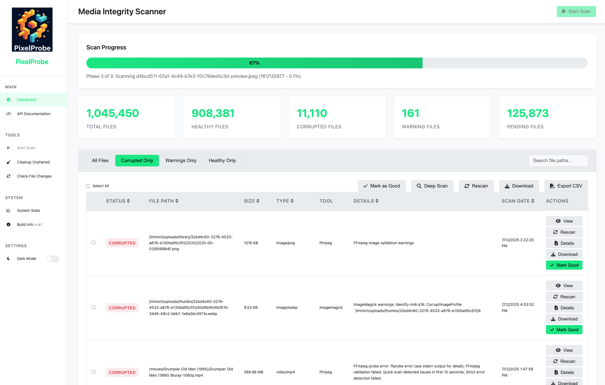

The modern desktop interface features:
- Modern design with clean, professional aesthetics
- Sidebar navigation for easy access to all features
- Real-time statistics dashboard showing file health status
- Advanced filtering and search capabilities
- Bulk action support for managing multiple files

#### Dark Mode
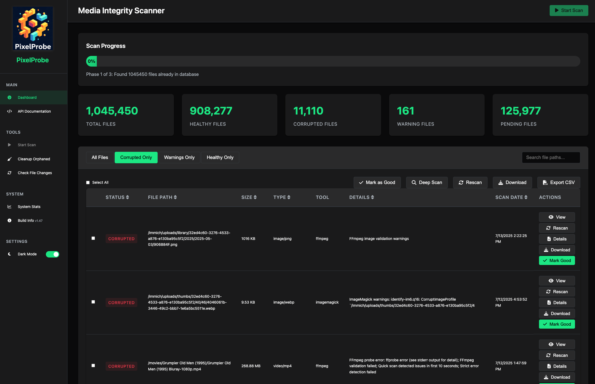

PixelProbe includes a sophisticated dark mode:
- High contrast design optimized for low-light environments
- Consistent color scheme across all UI elements
- Smooth theme transitions
- Automatic theme persistence

### Mobile Interface

<div align="center">
  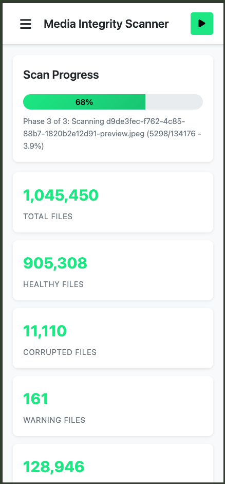
  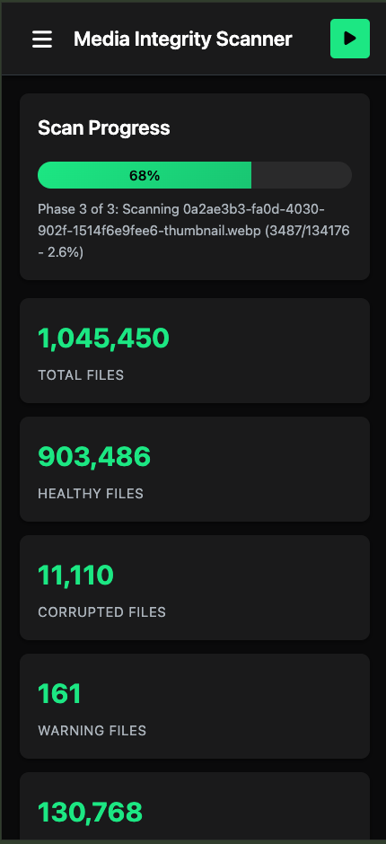
</div>

The mobile interface is fully responsive and touch-optimized:
- Adaptive layout that works on all screen sizes
- Touch-friendly buttons and controls
- Collapsible sidebar navigation
- Card-based design for scan results on mobile

<div align="center">
  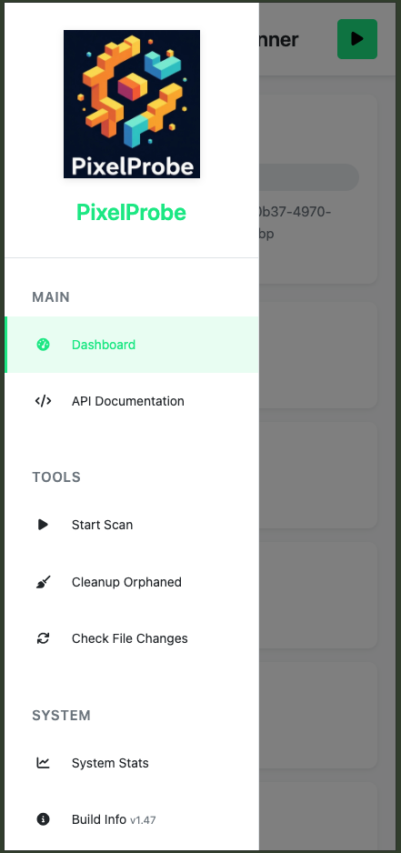
  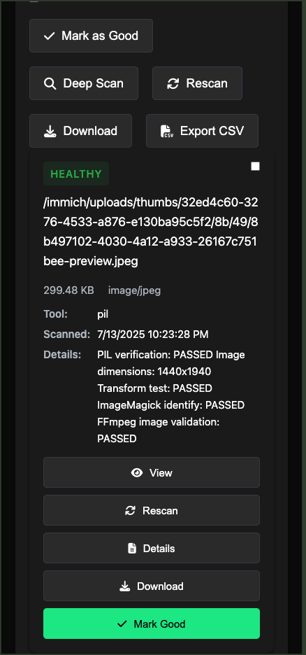
</div>

### Feature Highlights

#### System Statistics Modal
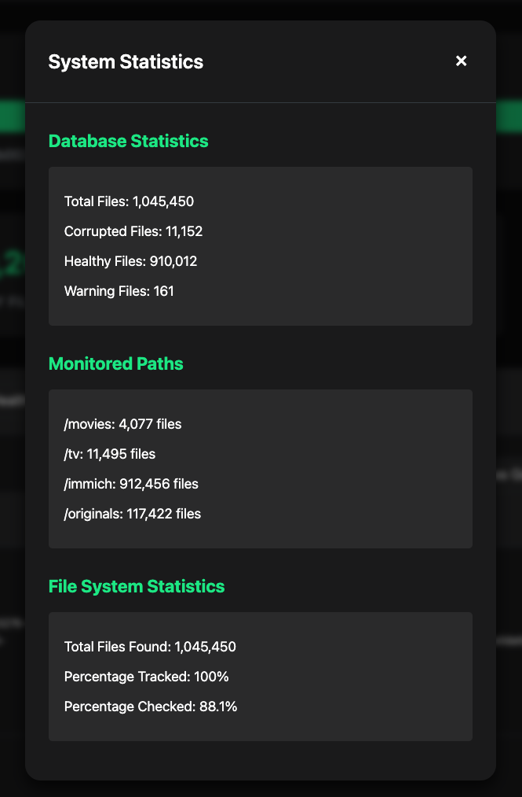

Comprehensive system overview showing:
- Database statistics with file counts by status
- Monitored paths with accessibility status
- Scan performance metrics
- File system completion percentages

#### Scan Output Details
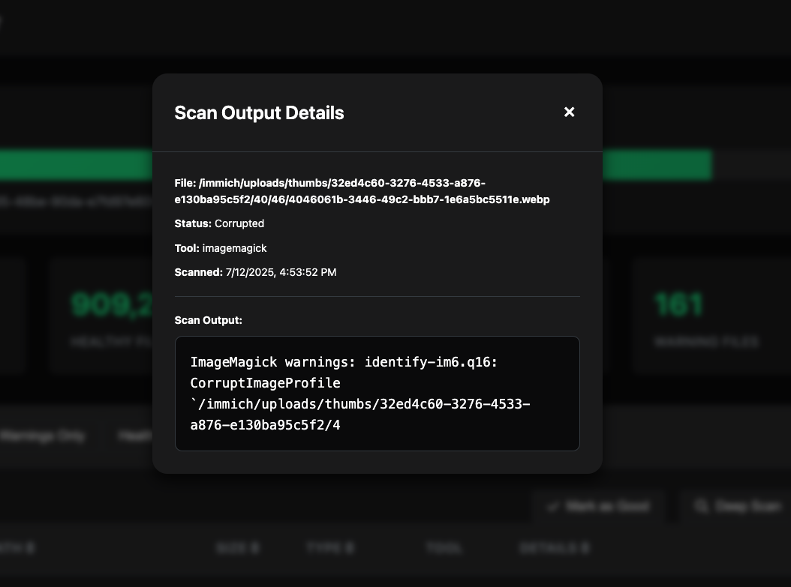

Detailed scan results viewer:
- Shows specific corruption or warning details
- Displays which tool detected the issue
- Provides full scan output for debugging

### Advanced Features

#### Scan Reports
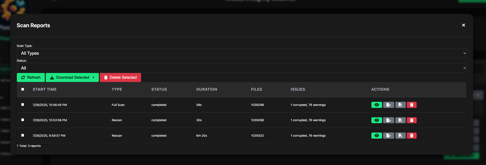

Comprehensive scan reporting with history and analytics:
- View all past scan operations with detailed statistics
- Filter by scan type (full scan, rescan, deep scan, cleanup, file changes)
- See duration, files processed, and issues found for each scan
- Export reports as JSON for data analysis or PDF for documentation
- Bulk actions: refresh or delete multiple reports at once
- Actions include viewing details, exporting JSON/PDF, and deleting reports

#### Scheduled Scanning
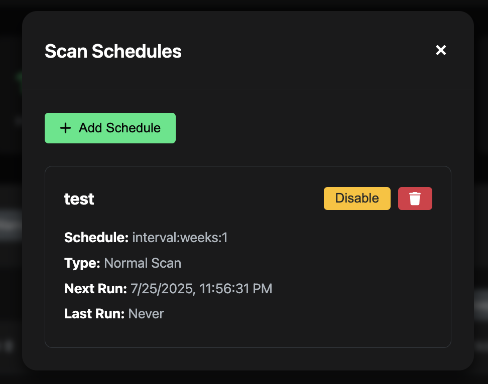

Create and manage automated scan schedules:
- Support for both cron expressions and simple intervals
- Multiple scan types: Normal Scan, Orphan Cleanup, File Changes
- View next run times and last execution status
- Enable/disable schedules with a single click

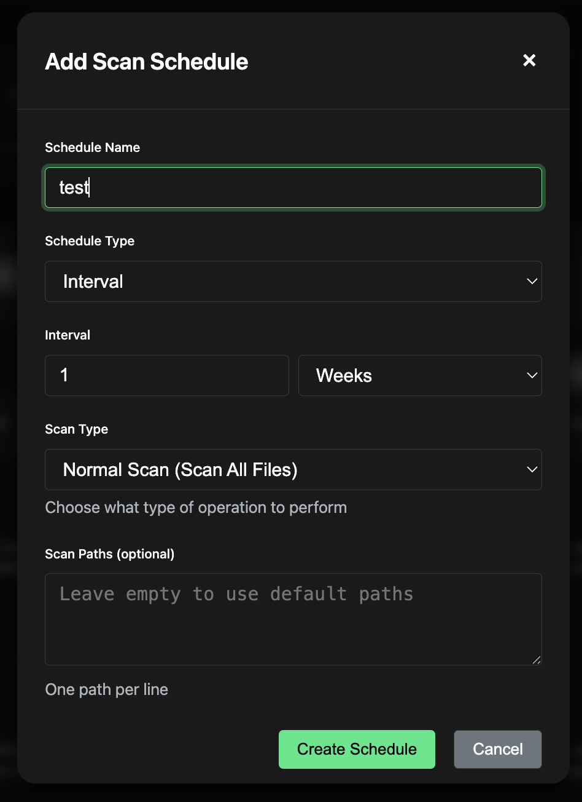

Flexible scheduling options:
- Name your schedules for easy identification
- Choose between cron expressions for advanced users or simple intervals
- Select scan type to automate different maintenance tasks
- Optionally specify custom scan paths

#### Exclusion Management
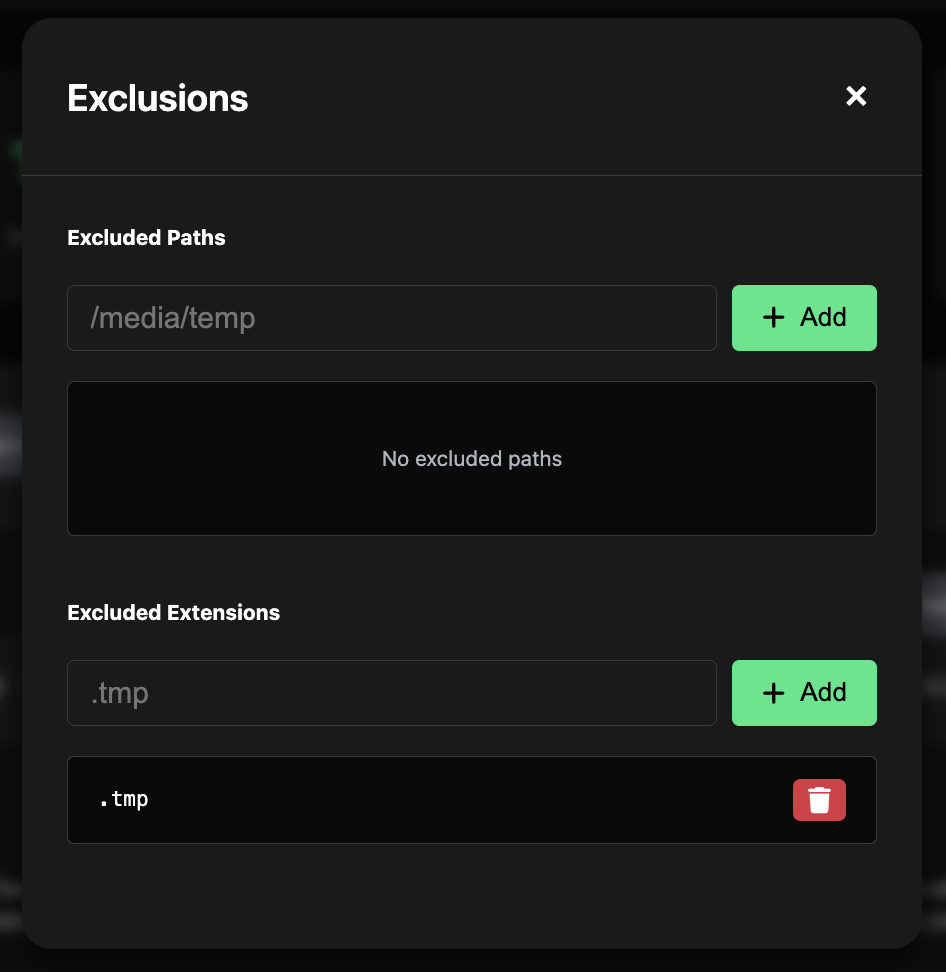

Interactive exclusion management with modern UI:
- Add exclusions individually with dedicated input fields
- Remove specific exclusions with one-click delete buttons
- See all exclusions at a glance in a clean list format
- Press Enter to quickly add new exclusions
- Separate management for paths and file extensions
- Real-time updates with no page refresh needed

## 🚀 Quick Start

### Using Docker (Recommended)

1. **Clone the repository**:
   ```bash
   git clone https://github.com/ttlequals0/PixelProbe.git
   cd PixelProbe
   ```

2. **Configure environment variables**:
   ```bash
   cp .env.example .env
   ```
   Edit `.env` and set required variables:
   ```bash
   # Generate a secure secret key
   python -c "import secrets; print(secrets.token_hex(32))"
   
   # Edit .env file with your values
   SECRET_KEY=your-generated-secret-key-here
   MEDIA_PATH=/path/to/your/actual/media/directory
   SCAN_PATHS=/media
   ```

3. **Start the application**:
   ```bash
   docker-compose up -d
   ```

4. **Access the web interface**:
   Open http://localhost:5001 in your browser

5. **Start scanning**:
   Click "Scan All Files" to begin analyzing your media library

### Docker Image Versions

PixelProbe is available on Docker Hub as `ttlequals0/pixelprobe`. Check the [Docker Hub page](https://hub.docker.com/r/ttlequals0/pixelprobe/tags) for all available versions.

**Current stable versions:**
- **`ttlequals0/pixelprobe:latest`** - Latest stable release (v2.1.0)
- **`ttlequals0/pixelprobe:2.1.0`** - Major milestone with 80+ improvements

You can specify a specific version in your `docker-compose.yml`:
```yaml
services:
  pixelprobe:
    image: ttlequals0/pixelprobe:2.1.0  # or :latest for newest
```

### Development Setup

1. **Clone the repository**:
   ```bash
   git clone https://github.com/ttlequals0/PixelProbe.git
   cd PixelProbe
   ```

2. **Use development compose file**:
   ```bash
   docker-compose -f docker-compose.dev.yml up -d
   ```

### Manual Installation

1. **Install dependencies**:
   ```bash
   # System dependencies
   sudo apt-get update
   sudo apt-get install ffmpeg imagemagick libmagic1
   
   # Python dependencies
   pip install -r requirements.txt
   ```

2. **Configure environment**:
   ```bash
   cp .env.example .env
   # Edit .env with your settings
   ```

3. **Run the application**:
   ```bash
   python app.py
   ```

## Configuration

### Environment Variables

PixelProbe uses environment variables for all configuration. Copy `.env.example` to `.env` and customize:

```bash
cp .env.example .env
```

**Required Variables:**

- `SECRET_KEY` - Secure secret key for Flask sessions (generate with: `python -c "import secrets; print(secrets.token_hex(32))"`)
- `MEDIA_PATH` - Host path to your media files (for Docker volume mounting)

**Optional Variables:**

- `DATABASE_URL` - Database connection string (default: SQLite)
- `SCAN_PATHS` - Comma-separated directories to monitor inside container (default: `/media`)
- `TZ` - Timezone (default: UTC)
- `MAX_FILES_TO_SCAN` - Performance limit (default: 100)
- `MAX_SCAN_WORKERS` - Parallel scanning threads (default: 4)
- `PERIODIC_SCAN_SCHEDULE` - Automated scanning schedule
- `CLEANUP_SCHEDULE` - Automated cleanup schedule
- `EXCLUDED_PATHS` - Paths to ignore during scanning
- `EXCLUDED_EXTENSIONS` - File extensions to ignore

See `.env.example` for complete configuration options with examples.

### Docker Configuration

The docker-compose.yml is fully configured to use environment variables from your `.env` file:

```yaml
services:
  pixelprobe:
    image: ttlequals0/pixelprobe:2.0.132  # Specify version
    environment:
      - SCAN_PATHS=/media
      - DATABASE_URL=sqlite:///media_checker.db
    volumes:
      - ${MEDIA_PATH}:/media
```

**Recommended**: Always specify a version tag instead of using `:latest` to ensure consistent deployments.

### Multiple Scan Paths

You can configure multiple directories to scan:

**Method 1: Docker Compose with Multiple Volumes**
```yaml
environment:
  - SCAN_PATHS=/movies,/tv-shows,/backup
volumes:
  - /mnt/movies:/movies
  - /mnt/tv-shows:/tv-shows  
  - /mnt/backup:/backup
```

**Method 2: Single Volume with Subdirectories**
```bash
export MEDIA_PATH=/mnt/all-media  # Contains subdirs: movies/, tv/, backup/
# docker-compose.yml uses: SCAN_PATHS=/media/movies,/media/tv,/media/backup
```

**For Docker**: Set the `MEDIA_PATH` environment variable for volume mounting:
```bash
export MEDIA_PATH=/path/to/your/actual/media
docker-compose up -d
```

## Usage

### Web Interface

1. **Access the Dashboard**: Navigate to http://localhost:5001
2. **Start a Scan**: Click "Scan All Files" to begin scanning your media directories
3. **View Results**: Results appear in the table below with corruption status
4. **Filter Results**: Use the filter buttons to show only corrupted or healthy files
5. **File Actions**: 
   - **Rescan**: Re-examine a specific file
   - **Download**: Download the file to your local machine
6. **Schedules**: Manage automated scan schedules with multiple scan types (v2.0.44+)
   - Create schedules for normal scans, orphan cleanup, or file changes detection
   - Use cron expressions or simple intervals
   - Enable/disable schedules on demand
7. **Exclusions**: Interactive management of paths and extensions to exclude (v2.0.44+)
   - Add exclusions individually with dedicated input fields
   - Remove specific exclusions with one click
   - Press Enter to quickly add new exclusions

### API Endpoints

The application provides REST API endpoints:

- `GET /api/stats` - Get scanning statistics
- `GET /api/scan-results` - Get paginated scan results
- `POST /api/scan-all` - Start a full scan of all configured directories
- `POST /api/scan-file` - Scan a specific file
- `GET /api/download/<id>` - Download a file
- `GET /api/schedules` - List all scan schedules (v2.0.41+)
- `POST /api/schedules` - Create a new scan schedule (v2.0.41+)
- `PUT /api/schedules/<id>` - Update a scan schedule (v2.0.41+)
- `DELETE /api/schedules/<id>` - Delete a scan schedule (v2.0.41+)
- `GET /api/exclusions` - Get current exclusions (v2.0.41+)
- `PUT /api/exclusions` - Update exclusions (v2.0.41+)
- `POST /api/exclusions/<type>/<item>` - Add individual exclusion (v2.0.44+)
- `DELETE /api/exclusions/<type>/<item>` - Remove individual exclusion (v2.0.44+)

### Command Line Usage

You can also use the PixelProbe class directly in Python:

```python
from media_checker import PixelProbe

checker = PixelProbe()

# Scan a single file
result = checker.scan_file('/path/to/media/file.mp4')
print(f"Corrupted: {result['is_corrupted']}")

# Scan multiple directories
results = checker.scan_directories(['/path/to/media1', '/path/to/media2'])
for result in results:
    if result['is_corrupted']:
        print(f"Corrupted file: {result['file_path']}")
```

## Corruption Detection

PixelProbe uses multiple methods to detect file corruption:

### Video Files
- **FFmpeg Analysis**: Deep analysis of video streams and metadata
- **Frame Validation**: Attempts to decode video frames to detect corruption
- **Quick Scan**: Fast check of first 10 seconds for immediate feedback
- **Stream Validation**: Verifies video and audio stream integrity
- **HEVC/ProRes Support**: Specialized detection for modern codecs

### Image Files
- **PIL Verification**: Uses Python Imaging Library for basic corruption detection
- **ImageMagick**: Advanced image analysis and validation
- **Dimension Checks**: Validates image dimensions and properties
- **Format Validation**: Ensures files match their declared format
- **RAW/HEIC Support**: Handles camera RAW files and Apple's HEIC format

### Audio Files
- **FFmpeg Audio Analysis**: Comprehensive audio stream validation
- **Decode Testing**: Attempts to decode audio to detect corruption
- **Header Validation**: Checks for missing or corrupted headers
- **Format-Specific Tests**: 
  - FLAC: CRC validation and built-in integrity checking
  - MP3: Frame header validation
  - Lossless formats: Bit-perfect verification
- **Deep Scan Mode**: Full file analysis for timestamp and packet errors

### Detection Accuracy
- **High Confidence**: 100% detection of files with broken headers, truncated files, and I/O errors
- **Moderate Confidence**: ~85% detection of random corruption patterns
- **Low Confidence**: ~50% detection of zero-byte overwrites

## Supported File Formats

### Video Formats
- **Common**: MP4, MKV, AVI, MOV, WMV, FLV, WebM, M4V
- **HEVC/H.265**: HEVC, H265 
- **Professional**: ProRes, MXF, DNxHD, DNxHR
- **Broadcast**: MTS, M2TS, AVCHD
- **Legacy**: MPG, MPEG, VOB, RM, RMVB
- **Other**: 3GP, 3G2, F4V, F4P, OGV, ASF, AMV, M2V, SVI

### Image Formats
- **Common**: JPEG, PNG, GIF, BMP, TIFF, WebP
- **Apple**: HEIC, HEIF
- **RAW Formats**: 
  - Canon: CR2, CR3
  - Nikon: NEF, NRW
  - Sony: ARW, SRF, SR2
  - Adobe: DNG
  - Others: ORF (Olympus), RW2 (Panasonic), PEF/PTX (Pentax), RAF (Fujifilm), X3F (Sigma), DCR/KDC (Kodak), MOS (Leaf)
- **Professional**: PSD, EXR, HDR, SVG
- **Other**: ICO, PBM, PGM, PPM, PNM, FITS

### Audio Formats (NEW!)
- **Lossy**: MP3, AAC, M4A, WMA, OGG, OGA, Opus, AMR
- **Lossless**: FLAC, WAV, AIFF, APE, WV (WavPack), TTA, CAF
- **Uncompressed**: WAV, AIFF, AU, SND, VOC
- **High-Resolution**: DSF, DFF (DSD)
- **Dolby/DTS**: AC3, DTS
- **Container**: MKA (Matroska Audio), M4B (Audiobook)
- **Legacy**: RA, RAM (RealAudio), GSM, MIDI

## Performance Considerations

- **Scan Duration**: Video scanning can take 2-20 minutes per file depending on size
- **Resource Usage**: CPU-intensive during scanning (80-100% utilization)
- **Memory Usage**: Minimal memory footprint, processes files individually
- **Disk I/O**: Sequential read access to media files

## Architecture

### Modular Architecture (v2.0.55+)

PixelProbe now features a clean, modular architecture following SOLID principles:

```
PixelProbe/
├── app.py                    # Application initialization (250 lines vs 2,500+)
├── pixelprobe/              # Main package
│   ├── api/                 # API Route Blueprints
│   │   ├── scan_routes.py   # Scan endpoints (/api/scan-*)
│   │   ├── stats_routes.py  # Statistics endpoints (/api/stats, /api/system-info)
│   │   ├── admin_routes.py  # Admin endpoints (configurations, schedules)
│   │   ├── export_routes.py # Export endpoints (CSV, view, download)
│   │   └── maintenance_routes.py # Cleanup and file-changes operations
│   ├── services/            # Business Logic Layer
│   │   ├── scan_service.py  # Scanning operations and orchestration
│   │   ├── stats_service.py # Statistics calculations
│   │   ├── export_service.py # Export functionality
│   │   └── maintenance_service.py # Cleanup and monitoring
│   ├── repositories/        # Data Access Layer
│   │   ├── base_repository.py # Generic repository pattern
│   │   ├── scan_repository.py # Scan result data operations
│   │   └── config_repository.py # Configuration data operations
│   └── utils/               # Shared Utilities
│       ├── helpers.py       # Common helper functions
│       ├── decorators.py    # Route decorators
│       └── validators.py    # Input validation
├── tests/                   # Comprehensive Test Suite
│   ├── conftest.py         # Pytest configuration and fixtures
│   ├── test_media_checker.py # Core functionality tests
│   ├── unit/               # Unit tests for each component
│   │   ├── test_scan_service.py
│   │   ├── test_stats_service.py
│   │   └── test_repositories.py
│   └── integration/        # API integration tests
├── media_checker.py        # Core corruption detection engine
├── models.py              # SQLAlchemy database models
├── static/                # Frontend assets
├── templates/             # HTML templates
└── requirements.txt       # Python dependencies
```

### Key Architectural Benefits

- **Separation of Concerns**: Each module has a single, well-defined responsibility
- **Testability**: Components can be tested in isolation with comprehensive test coverage
- **Maintainability**: Changes to one feature don't affect others
- **Scalability**: Easy to add new features without modifying existing code
- **API Compatibility**: All endpoints remain unchanged, ensuring backward compatibility

## 🛠️ Utility Tools

The `tools/` directory contains utility scripts for database maintenance and migration tasks. These are useful for:

- Fixing false positives from older versions
- Adding new database columns
- Resetting files for rescanning with updated logic

See [tools/README.md](tools/README.md) for detailed documentation on each tool.

## Documentation

### API Documentation
- **[API Reference](docs/api/README.md)** - Complete API documentation with endpoints, request/response examples
- **[OpenAPI Specification](docs/api/openapi.yaml)** - OpenAPI 3.0 specification for API integration
- **[Integration Guide](docs/examples/integration-guide.md)** - Examples for integrating PixelProbe into your workflows

### Developer Documentation
- **[Developer Guide](docs/developer/README.md)** - Setup, architecture, and contribution guidelines
- **[Architecture Overview](docs/ARCHITECTURE.md)** - System design and component architecture
- **[Project Structure](docs/PROJECT_STRUCTURE.md)** - Detailed code organization and module descriptions
- **[Performance Tuning](docs/PERFORMANCE_TUNING.md)** - Optimization guide for large-scale deployments

### API Client Examples
- **[Python Client](docs/examples/python-client.py)** - Full-featured Python client with CLI
- **[Node.js Client](docs/examples/nodejs-client.js)** - JavaScript/Node.js client implementation
- **[Bash Client](docs/examples/bash-client.sh)** - Shell script client using curl and jq

### Quick Start Examples

#### Python
```python
from pixelprobe_client import PixelProbeClient

client = PixelProbeClient("http://localhost:5000")
client.scan_directory(["/media/photos"])
stats = client.get_statistics()
print(f"Corruption rate: {stats['corruption_rate']}%")
```

#### JavaScript
```javascript
const PixelProbeClient = require('./pixelprobe-client');

const client = new PixelProbeClient('http://localhost:5000');
await client.scanDirectory(['/media/photos']);
const stats = await client.getStatistics();
console.log(`Corruption rate: ${stats.corruption_rate}%`);
```

#### Bash
```bash
# Scan directories
./pixelprobe-client.sh scan /media/photos /media/videos

# Get statistics
./pixelprobe-client.sh stats

# Export results
./pixelprobe-client.sh export results.csv
```

## Development

### Running in Development Mode

```bash
export FLASK_ENV=development
python app.py
```

### Testing

PixelProbe includes a comprehensive test suite covering core functionality, services, repositories, and API endpoints.

#### Running Tests

```bash
# Install test dependencies
pip install -r requirements-test.txt

# Run all tests
pytest

# Run with coverage report
pytest --cov=pixelprobe --cov-report=html

# Run specific test categories
pytest tests/unit/           # Unit tests only
pytest tests/integration/    # Integration tests only
pytest tests/test_media_checker.py  # Core functionality tests

# Run with verbose output
pytest -v

# Run with benchmark tests
pytest --benchmark-only
```

#### Test Categories

- **Unit Tests**: Test individual components in isolation
  - Service layer tests (scan, stats, export, maintenance)
  - Repository layer tests (data access patterns)
  - Utility function tests
  
- **Integration Tests**: Test API endpoints and full workflows
  - API endpoint tests with mock data
  - Database integration tests
  - File system operation tests
  
- **Performance Tests**: Benchmark critical operations
  - File scanning performance
  - Database query optimization
  - Memory usage monitoring

#### Writing Tests

When contributing, please include tests for new functionality:

```python
# Example test for new feature
def test_new_feature(scan_service, mock_scan_result):
    result = scan_service.new_feature(mock_scan_result)
    assert result.status == 'success'
```

### Adding New File Formats

To add support for new file formats:

1. Update `supported_formats` in `PixelProbe.__init__()`
2. Add detection logic in `_check_*_corruption()` methods
3. Update the documentation

### Contributing

1. Fork the repository
2. Create a feature branch
3. Make your changes
4. Add tests if applicable
5. Submit a pull request

## Troubleshooting

### Common Issues

**FFmpeg/ImageMagick not found**:
- Ensure FFmpeg and ImageMagick are installed and in PATH
- On Ubuntu/Debian: `sudo apt-get install ffmpeg imagemagick`
- On macOS: `brew install ffmpeg imagemagick`

**Permission errors**:
- Ensure the application has read access to your media directories
- Check file permissions and ownership

**Database errors**:
- Delete the database file to reset: `rm media_checker.db`
- Ensure write permissions in the application directory

**Memory issues with large files**:
- The application processes files individually to minimize memory usage
- For very large files, consider increasing system swap space

### Logs and Debugging

Enable debug logging by setting `FLASK_ENV=development` in your `.env` file.

## 🛠️ Troubleshooting

### Database Errors After Version Updates

If you encounter **"no such table: scan_results"** errors after upgrading PixelProbe, this indicates the database schema wasn't properly initialized. This typically happens during version upgrades when the container restarts.

**Quick Fix:**
```bash
# Run the database schema fix tool
docker exec pixelprobe python tools/fix_database_schema.py
```

**What this does:**
- Creates all missing database tables
- Runs necessary schema migrations  
- Creates performance indexes
- Verifies database accessibility

**Alternative one-liner:**
```bash
docker exec pixelprobe python -c "
from models import db; from app import app; 
ctx = app.app_context(); ctx.push(); 
db.create_all(); 
print('✅ Database tables created'); 
ctx.pop()
"
```

**Note:** New installations should not experience this issue - it's specific to existing installations being upgraded.

### Rate Limiting Issues (429 Errors)

If you see 429 "Too Many Requests" errors in browser console, this has been fixed in version 2.0.72+. Upgrade to the latest version:

```bash
# Update to latest version
docker-compose pull
docker-compose up -d
```

### Container Won't Start

If the container fails to start, check:

1. **SECRET_KEY is set** in your compose file
2. **Volume mounts exist** on the host system
3. **Port 5001 is available** (or change the port mapping)

### Web Interface Not Loading

1. **Check container health**: `docker ps` (should show "healthy")
2. **Verify port mapping**: Ensure `5001:5000` matches your setup
3. **Check logs**: `docker logs pixelprobe`

### Performance Issues

For large media libraries:
- Increase `MAX_SCAN_WORKERS` (default: 4, try 8-16 for powerful systems)
- Monitor system resources during scanning
- Use SSD storage for the database if possible

### Getting Help

1. **Check logs first**: `docker logs pixelprobe` 
2. **Try database fix**: Run the schema fix tool above
3. **Search existing issues**: [GitHub Issues](https://github.com/ttlequals0/PixelProbe/issues)
4. **Create new issue**: Include logs and system info

## License

This project is licensed under the MIT License - see the LICENSE file for details.

## Acknowledgments

- [FFmpeg](https://ffmpeg.org/) for video analysis
- [ImageMagick](https://imagemagick.org/) for image processing
- [PIL/Pillow](https://pillow.readthedocs.io/) for Python image handling
- Inspired by [check-media-integrity](https://github.com/ftarlao/check-media-integrity)
- Reference implementations from [broken-video-file-detector](https://github.com/EuropaYou/broken-video-file-detector) and [CorruptVideoFileInspector](https://github.com/nhershy/CorruptVideoFileInspector)

## Support

For issues, questions, or contributions, please visit the [GitHub repository](https://github.com/ttlequals0/PixelProbe/issues).