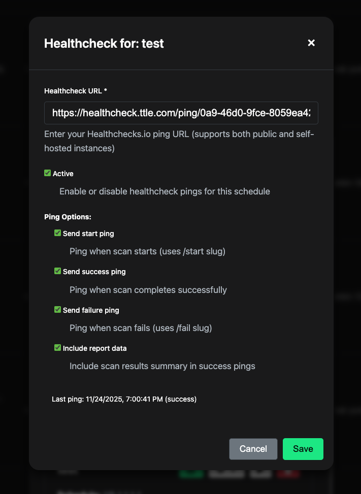
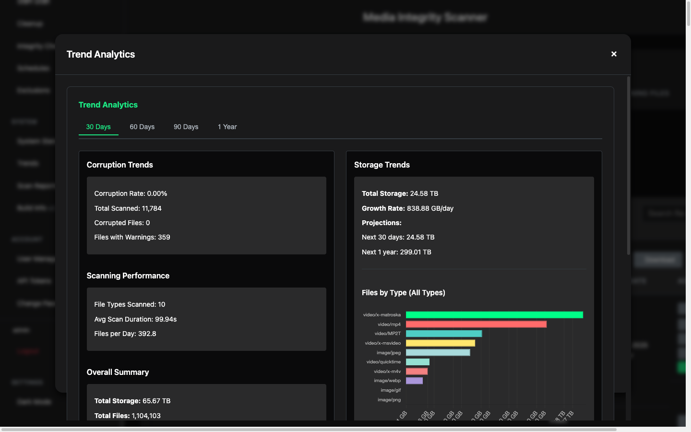
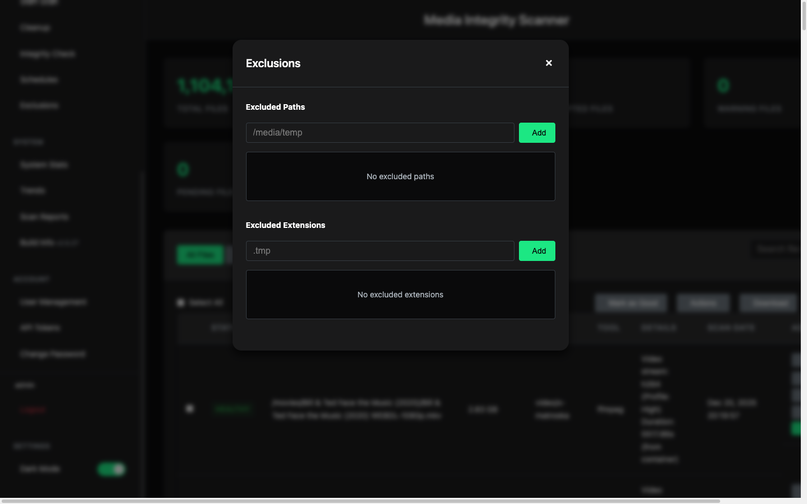

# PixelProbe

<div align="center">
  
</div>

## Overview

PixelProbe detects corrupted video, image, and audio files across your media libraries. It uses FFmpeg, ImageMagick, and PIL to validate files, and provides a web interface for browsing results, scheduling scans, and managing exclusions.

## Features

### Media Support
- Video format support (MP4, MKV, AVI, MOV, WebM, FLV, etc.)
- Image format detection (JPEG, PNG, GIF, BMP, TIFF, WebP, etc.)
- Audio file validation (MP3, FLAC, WAV, AAC, OGG, etc.)
- Large file support (tested with 50GB+ Bluray remux files)

### Detection Capabilities
- FFmpeg-based deep video analysis
- Video freeze detection (stuck frames while audio continues) via FFmpeg freezedetect filter with black frame false positive filtering
- ImageMagick and PIL image validation
- Bitrot detection: a content hash change without a matching mtime change flags the file for review instead of silently adopting the new hash
- Smart warning system for minor issues vs critical corruption
- Multi-stage detection with configurable thresholds
- Automatic retry logic for transient failures

### Scanning Features
- **Parallel multi-threaded scanning**: Configurable worker threads (10-24 workers recommended) with thread-safe database access
- **Real-time progress**: Live updates with ETA calculations and phase tracking
- **Multiple scan types**: Full scan, cleanup, integrity check
- **Rolling integrity queue**: Integrity checks sweep the library stalest-first in batches and resume where they left off; schedules can carry a per-run time budget so no single run monopolizes IO
- **Scheduled automated scans**: Cron expressions or simple intervals for hands-free monitoring
- **Smart exclusions**: Configure paths and file extensions to skip
- **Phase-based scanning**: Discovery → Database → Validation workflow
- **Bulk operations**: Rescan multiple files, deep analysis, batch actions

### Web Interface
- Modern responsive design with dark/light theme support
- Real-time scan progress with live polling updates
- Advanced filtering and search capabilities
- Bulk file selection and management with shift-click range selection
- Mobile-optimized touch interface
- In-browser media file viewing and streaming
- Detailed file corruption reports

### System Features
- **PostgreSQL database**: Reliable ACID-compliant data storage
- **Redis-backed task queue**: Background processing with Celery workers
- **Docker deployment**: Multi-container architecture (web, workers, database, queue)
- **REST API**: Full OpenAPI/Swagger documentation
- **Monitoring & Reports**: Real-time statistics, trend analytics, storage projections, PDF/JSON exports, complete audit trail
- **View Logs**: In-app log viewer with live polling, level/time/search filtering, traceback expansion, and log download
- **Path filter**: Filter scan results by configured scan path
- **Performance optimized**: Production-tested with millions of files

### Security & Authentication
- **Multi-user support**: Role-based access control with admin privileges
- **Secure password storage**: Bcrypt hashing with minimum 8 character passwords
- **API token authentication**: Generate and manage tokens for programmatic access
- **Session management**: Cookie-based sessions with CSRF protection, configurable timeout
- **First-run setup wizard**: Secure admin account creation on initial deployment
- **Audit logging**: Complete security event tracking

## Screenshots

### Authentication & User Management

#### Login Screen


Username/password login with remember-me and first-run setup detection.

#### User Management


Create, view, and delete user accounts with role-based access control.

#### API Token Management


Generate and revoke API tokens for programmatic access.

#### Password Management


Change password with current-password verification.

### Desktop Interface

#### Light Mode


Statistics dashboard, sortable results table with bulk actions, and sidebar navigation.

#### Dark Mode


Full feature parity with a high-contrast dark theme. Preference persists across sessions.

### Mobile Interface

<div align="center">
  
  
</div>

The mobile interface is fully responsive and touch-optimized:
- Adaptive layout that works on all screen sizes
- Touch-friendly buttons and controls
- Collapsible sidebar navigation
- Card-based design for scan results on mobile

### Advanced Features

#### Scan Reports


View past scan operations with statistics, filter by scan type, and export as JSON or PDF.

#### Scheduled Scanning


Set up automated scans using cron expressions or simple intervals. Supports normal scan, cleanup, and integrity check types.

#### Healthcheck Monitoring


Integrate with [Healthchecks.io](https://healthchecks.io/) or self-hosted instances. Sends start, success, and failure pings per schedule, with optional scan summary data.

#### Trend Analytics


Corruption rates, storage growth, and performance metrics across 30/60/90-day and 1-year windows. Includes per-type breakdowns, growth projections, and interactive charts.

#### Exclusions Management


Skip specific directories or file extensions. Changes take effect on the next scan without a restart.

## Documentation

### Installation & Setup
- [Docker Setup Guide](docs/DOCKER_SETUP.md) - Complete Docker Compose setup with container explanations
- [Installation Guide](docs/INSTALLATION.md) - Detailed installation instructions
- [Configuration Guide](docs/CONFIGURATION.md) - Environment variables and configuration options

### System & Architecture
- [System Architecture](docs/SYSTEM_ARCHITECTURE.md) - Container architecture, Celery queues, and data flow
- [Architecture Overview](docs/ARCHITECTURE.md) - Application layers and design patterns
- [Project Structure](docs/PROJECT_STRUCTURE.md) - Codebase organization and module overview
- [Performance Tuning](docs/PERFORMANCE_TUNING.md) - Optimization strategies for large-scale deployments

### API & Integration
- [API Documentation](docs/api/README.md) - Complete REST API reference with authentication guide
- [OpenAPI Specification](openapi.yaml) - OpenAPI 3.0 spec for API documentation
- [Scan Types Documentation](docs/api/SCAN_TYPES_DOCUMENTATION.md) - Guide to all scan types
- [Integration Guide](docs/examples/integration-guide.md) - Best practices for integrating with PixelProbe

### Client Examples
- [Python Client](docs/examples/python-client.py) - Full-featured Python client with CLI
- [Node.js Client](docs/examples/nodejs-client.js) - JavaScript/Node.js client implementation
- [Bash Client](docs/examples/bash-client.sh) - Shell script client using curl and jq

### Development & Maintenance
- [Developer Guide](docs/developer/README.md) - Development setup and contribution guidelines
- [Testing Guide](docs/developer/testing-guide.md) - Testing strategy and running tests
- [Release Process](docs/developer/release-process.md) - How to create and publish releases
- [Tools & Scripts](docs/maintenance/TOOLS_AND_SCRIPTS.md) - Maintenance utilities and scripts
- [Troubleshooting Guide](docs/TROUBLESHOOTING.md) - Common issues and solutions

### Additional Resources
- [Database Schema](docs/developer/database-schema.md) - Complete database structure documentation
- [Complete Documentation Index](docs/README.md) - Full documentation directory with organized links

## Quick Start

### Using Docker (Recommended)

1. **Clone the repository**:
   ```bash
   git clone https://github.com/ttlequals0/PixelProbe.git
   cd PixelProbe
   ```

2. **Configure environment variables**:
   ```bash
   cp .env.example .env
   ```
   Edit `.env` and set required variables:
   ```bash
   # Generate a secure secret key
   python -c "import secrets; print(secrets.token_hex(32))"
   
   # Edit .env file with your values
   SECRET_KEY=your-generated-secret-key-here
   MEDIA_PATH=/path/to/your/actual/media/directory
   SCAN_PATHS=/media
   ```

3. **Start the application**:
   ```bash
   docker-compose up -d
   ```

4. **Access the web interface**:
   Open http://localhost:5000 in your browser

5. **Initial Setup** (IMPORTANT - First Run Only):

   On first run, you must create the admin account via the setup endpoint:

   ```bash
   # Create admin user with your chosen password
   curl -X POST http://localhost:5000/api/auth/setup \
     -H "Content-Type: application/json" \
     -d '{"password":"YourSecurePassword123"}'
   ```

   Or visit http://localhost:5000/login and follow the first-run setup wizard.

   **Security Note**: No default admin account exists. You must explicitly create it on first run.

6. **Start scanning**:
   - After login, click "Scan All Files" to begin analyzing your media library
   - Configure exclusions and schedules as needed

### Docker Image Versions

PixelProbe is available on Docker Hub as `ttlequals0/pixelprobe`:

- **`ttlequals0/pixelprobe:latest`** - Latest stable release

## Requirements

**Important**: PixelProbe requires PostgreSQL.

## Configuration

### Environment Variables

PixelProbe uses environment variables for all configuration. Copy `.env.example` to `.env` and customize:

**Required Variables:**
- `SECRET_KEY` - Secure secret key for Flask sessions
- `MEDIA_PATH` - Host path to your media files (for Docker volume mounting)

**Optional Variables:**
- `SCAN_PATHS` - Comma-separated directories to monitor inside container (default: `/media`)
- `TZ` - Timezone (default: UTC)
- `CELERY_CONCURRENCY` - Concurrent Celery tasks (default: 4, recommended: 8-12)
  * Directory scans are split into chunks distributed across these slots,
    so this is the main scan-throughput knob (since v2.6.49)
- `MAX_WORKERS` - Parallel workers for selected-file rescans (default: 10)
- `BATCH_SIZE` - Files per batch during discovery (default: 100)
- `DISCOVERY_TASK_TIMEOUT_SECS` - Per-directory discovery walk limit (default: 3600)
- `DB_POOL_SIZE` / `DB_MAX_OVERFLOW` - SQLAlchemy pool per process (defaults: 5 / 10)
- `CORS_ORIGINS` - Comma-separated origins allowed cross-origin API access (default: none)
- `SESSION_COOKIE_SECURE` - Secure session cookies (default: `true`; set `false` for plain-HTTP LAN use)
- `RATELIMIT_STORAGE_URI` - Rate-limit counter store (default: derived from the Redis broker URL)
- `PERIODIC_SCAN_SCHEDULE` - Automated scanning schedule
- `CLEANUP_SCHEDULE` - Automated cleanup schedule
- `EXCLUDED_PATHS` - Paths to ignore during scanning
- `EXCLUDED_EXTENSIONS` - File extensions to ignore
- `FREEZE_DETECTION_ENABLED` - Enable video freeze detection (default: `true`). Set to `false` to skip freeze detection and reduce scan time for large video libraries

See `.env.example` for complete configuration options with examples.

### Multiple Scan Paths

You can configure multiple directories to scan:

**Method 1: Docker Compose with Multiple Volumes**
```yaml
environment:
  - SCAN_PATHS=/movies,/tv-shows,/backup
volumes:
  - /mnt/movies:/movies
  - /mnt/tv-shows:/tv-shows  
  - /mnt/backup:/backup
```

**Method 2: Single Volume with Subdirectories**
```bash
export MEDIA_PATH=/mnt/all-media  # Contains subdirs: movies/, tv/, backup/
# docker-compose.yml uses: SCAN_PATHS=/media/movies,/media/tv,/media/backup
```

## Usage

### Web Interface

1. **Access the Dashboard**: Navigate to http://localhost:5000
2. **Start a Scan**: Click "Scan All Files" to begin scanning your media directories
3. **View Results**: Results appear in the table below with corruption status
4. **Filter Results**: Use the filter buttons to show only corrupted or healthy files
5. **Bulk Selection**: Select multiple files using checkboxes, or use Shift+click to select ranges
6. **File Actions**:
   - **View**: Stream and preview media files directly in your browser
   - **Rescan**: Re-examine a specific file for corruption
   - **Download**: Download the file to your local machine
   - **Mark as Good**: Mark false positives as healthy (supports bulk operations up to 1000 files)
   - **Integrity Check**: Verify file still exists and hasn't changed
7. **Schedules**: Manage automated scan schedules with multiple scan types
8. **Exclusions**: Interactive management of paths and extensions to exclude
9. **Ignored Errors**: Configure error patterns to suppress known benign warnings (e.g., codec-specific messages)
10. **Trend Analytics**: View corruption trends, storage growth, and projections over multiple time periods
11. **View Logs**: Browse application logs with level/time/search filtering, auto-refresh, and download
12. **Path Filter**: Filter scan results by configured scan path using the dropdown in the filter bar

### API Documentation

PixelProbe provides a REST API with OpenAPI/Swagger documentation.

#### Interactive API Documentation
- **Swagger UI**: Available at `/api/v1/docs` when logged in
- **OpenAPI Spec**: Full API specification with request/response schemas
- **Try it out**: Test endpoints directly from the documentation

#### Authentication Endpoints
- `GET /api/auth/status` - Check authentication status
- `POST /api/auth/login` - User login
- `POST /api/auth/logout` - User logout
- `POST /api/auth/setup` - First-run admin setup
- `GET /api/auth/users` - List all users (admin only)
- `POST /api/auth/users` - Create new user (admin only)
- `DELETE /api/auth/users/{id}` - Delete user (admin only)
- `PUT /api/auth/users/{id}/password` - Change user password
- `GET /api/auth/tokens` - List user's API tokens
- `POST /api/auth/tokens` - Create new API token
- `DELETE /api/auth/tokens/{id}` - Revoke API token

#### Scanning Endpoints
- `GET /api/stats` - Get scanning statistics
- `GET /api/trends` - Get corruption and storage trends over multiple time periods (30/60/90 days, 1 year)
- `GET /api/scan-results` - Get paginated scan results with filtering
- `POST /api/scan` - Start a directory scan
- `POST /api/scan/parallel` - Start parallel scan with Celery
- `GET /api/scan-status` - Get current scan progress
- `POST /api/cancel-scan` - Cancel running scan
- `POST /api/rescan-file` - Rescan specific file
- `POST /api/deep-scan` - Perform deep analysis

#### Maintenance Endpoints
- `POST /api/cleanup` - Remove orphaned database entries
- `GET /api/cleanup-status` - Get cleanup operation status
- `POST /api/file-changes` - Detect file system changes (optional `time_budget_minutes`)
- `GET /api/file-changes-status` - Get file changes scan status
- `POST /api/bitrot/accept` - Accept a bitrot-suspected file's current content as the new baseline
- `POST /api/reset-for-rescan` - Reset files for rescanning
- `POST /api/reset-files-by-path` - Reset specific files by path

#### Schedule Management
- `GET /api/schedules` - List all scan schedules
- `POST /api/schedules` - Create new schedule
- `PUT /api/schedules/{id}` - Update schedule
- `DELETE /api/schedules/{id}` - Delete schedule
- `GET /api/schedule-types` - Get available schedule types

#### Healthcheck Integration
- `GET /api/healthcheck/schedule/{id}` - Get healthcheck config for a schedule
- `POST /api/healthcheck` - Create healthcheck configuration
- `PUT /api/healthcheck/{id}` - Update healthcheck configuration
- `DELETE /api/healthcheck/{id}` - Delete healthcheck configuration

#### System Configuration
- `GET /api/exclusions` - Get path and extension exclusions
- `PUT /api/exclusions` - Update exclusions
- `GET /api/ignored-errors` - Get ignored error patterns
- `POST /api/ignored-errors` - Add ignored error pattern
- `DELETE /api/ignored-errors/{id}` - Remove error pattern

#### Log Viewing
- `GET /api/logs` - Get paginated log entries with filtering and polling
- `GET /api/logs/runs` - List scan/job runs with log counts
- `GET /api/logs/download` - Download filtered logs as text file
- `GET /api/logs/retention` - Get log retention settings
- `PUT /api/logs/retention` - Set log retention period
- `POST /api/logs/purge` - Purge log entries (requires filter)
- `GET /api/scan-paths` - Get configured scan paths for filtering

#### Data Export
- `POST /api/export` - Export scan results (CSV, JSON, PDF)
- `GET /api/reports` - List generated reports
- `GET /api/reports/{filename}` - Download specific report

### API Authentication

#### Session Authentication (Web UI)
```javascript
// Login via web form
fetch('/api/auth/login', {
    method: 'POST',
    headers: {'Content-Type': 'application/json'},
    body: JSON.stringify({
        username: 'admin',
        password: 'your_password'
    }),
    credentials: 'include'
});
```

#### Bearer Token Authentication (API)
```python
import requests

# Create API token via web UI or API
headers = {
    'Authorization': 'Bearer your_api_token_here'
}

# Make authenticated API request
response = requests.get(
    'http://localhost:5000/api/stats',
    headers=headers
)
```

#### cURL Examples
```bash
# Login and get session cookie
curl -X POST http://localhost:5000/api/auth/login \
  -H "Content-Type: application/json" \
  -d '{"username":"admin","password":"password"}' \
  -c cookies.txt

# Use session cookie for requests
curl http://localhost:5000/api/stats -b cookies.txt

# Or use API token
curl http://localhost:5000/api/stats \
  -H "Authorization: Bearer your_api_token_here"
```

### Command Line Usage

```python
from pixelprobe.media_checker import PixelProbe

checker = PixelProbe()

# Scan a single file
result = checker.scan_file('/path/to/media/file.mp4')
print(f"Corrupted: {result['is_corrupted']}")

# Scan multiple directories
results = checker.scan_directories(['/path/to/media1', '/path/to/media2'])
for result in results:
    if result['is_corrupted']:
        print(f"Corrupted file: {result['file_path']}")
```

## Supported File Formats

### Video Formats
- **Common**: MP4, MKV, AVI, MOV, WMV, FLV, WebM, M4V
- **HEVC/H.265**: HEVC, H265 
- **Professional**: ProRes, MXF, DNxHD, DNxHR
- **Broadcast**: MTS, M2TS, AVCHD
- **Legacy**: MPG, MPEG, VOB, RM, RMVB

### Image Formats
- **Common**: JPEG, PNG, GIF, BMP, TIFF, WebP
- **Apple**: HEIC, HEIF
- **RAW Formats**: CR2, CR3, NEF, NRW, ARW, DNG, ORF, RW2, PEF, RAF

### Audio Formats
- **Lossy**: MP3, AAC, M4A, WMA, OGG, OGA, Opus
- **Lossless**: FLAC, WAV, AIFF, APE, WV
- **High-Resolution**: DSF, DFF (DSD)
- **Dolby/DTS**: AC3, DTS

## Development

### Development Setup

1. **Clone the repository**:
   ```bash
   git clone https://github.com/ttlequals0/PixelProbe.git
   cd PixelProbe
   ```

2. **Use development compose file**:
   ```bash
   docker-compose -f docker-compose.dev.yml up -d
   ```

### Testing

```bash
# Install test dependencies
pip install -r requirements-test.txt

# Run all tests
pytest

# Run with coverage report
pytest --cov=pixelprobe --cov-report=html

# Run specific test categories
pytest tests/unit/           # Unit tests only
pytest tests/integration/    # Integration tests only
```

### Contributing

1. Fork the repository
2. Create a feature branch
3. Make your changes
4. Add tests if applicable
5. Submit a pull request

## Troubleshooting

### Database Errors After Updates

If you encounter **"no such table: scan_results"** errors after upgrading:

```bash
# Quick fix
docker exec pixelprobe python tools/fix_database_schema.py
```

### Common Issues

**FFmpeg/ImageMagick not found**:
- Ensure FFmpeg and ImageMagick are installed and in PATH
- On Ubuntu/Debian: `sudo apt-get install ffmpeg imagemagick`
- On macOS: `brew install ffmpeg imagemagick`

**Permission errors**:
- Ensure the application has read access to your media directories
- Check file permissions and ownership

**Performance issues with large libraries**:
- Increase `CELERY_CONCURRENCY` (default: 4, try 8-12) - directory scans are
  distributed as chunks across these worker slots
- Monitor system resources during scanning
- Use SSD storage for the database if possible

### Getting Help

1. **Check logs first**: `docker logs pixelprobe` 
2. **Search existing issues**: [GitHub Issues](https://github.com/ttlequals0/PixelProbe/issues)
3. **Create new issue**: Include logs and system info

## License

This project is licensed under the MIT License - see the LICENSE file for details.

## Acknowledgments

- [FFmpeg](https://ffmpeg.org/) for video analysis
- [ImageMagick](https://imagemagick.org/) for image processing
- [PIL/Pillow](https://pillow.readthedocs.io/) for Python image handling
- Inspired by media integrity checkers and corruption detectors

## Support

For issues, questions, or contributions, please visit the [GitHub repository](https://github.com/ttlequals0/PixelProbe/issues).

## LLM Disclosure

This project was developed using AI agents as a pair programmer. It was NOT vibe coded. For context, I'm a systems engineer who also writes code professionally with 15+ years of experience. The codebase follows engineering best practices, and all architecture and design decisions were made by me, not by AI. All code generated by LLMs was reviewed and tested by me, a human.