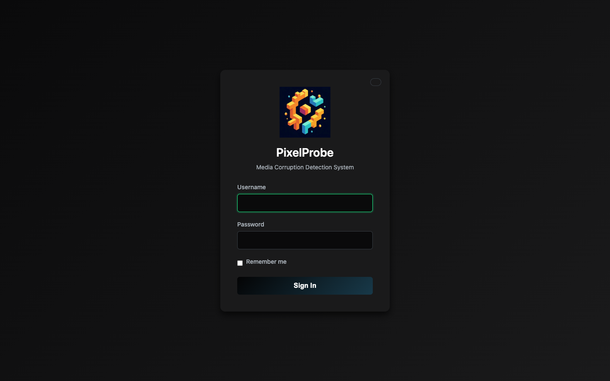
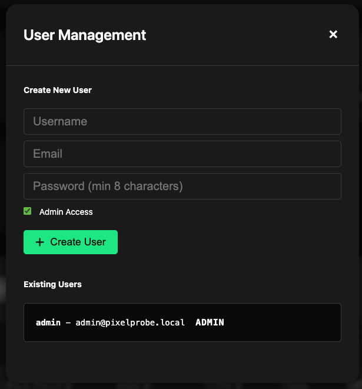
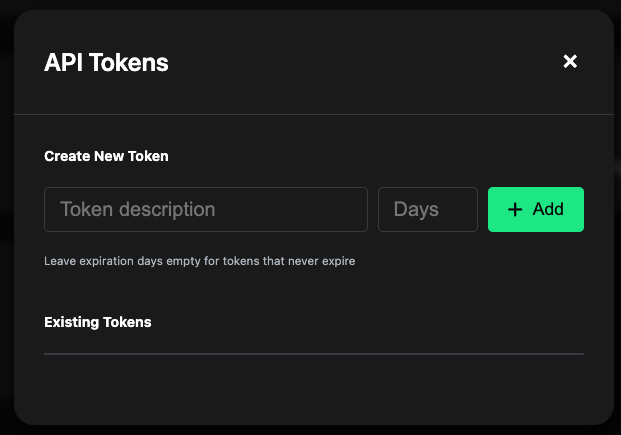
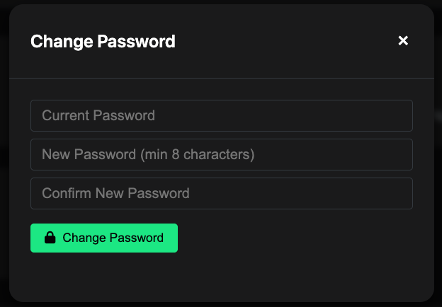
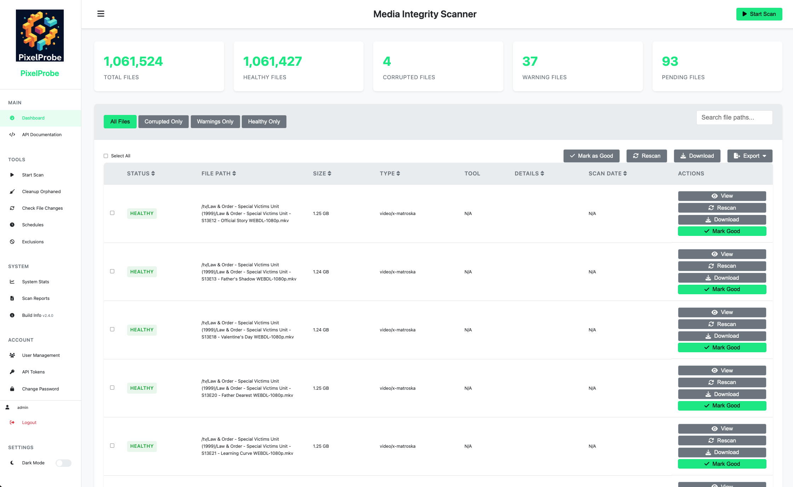
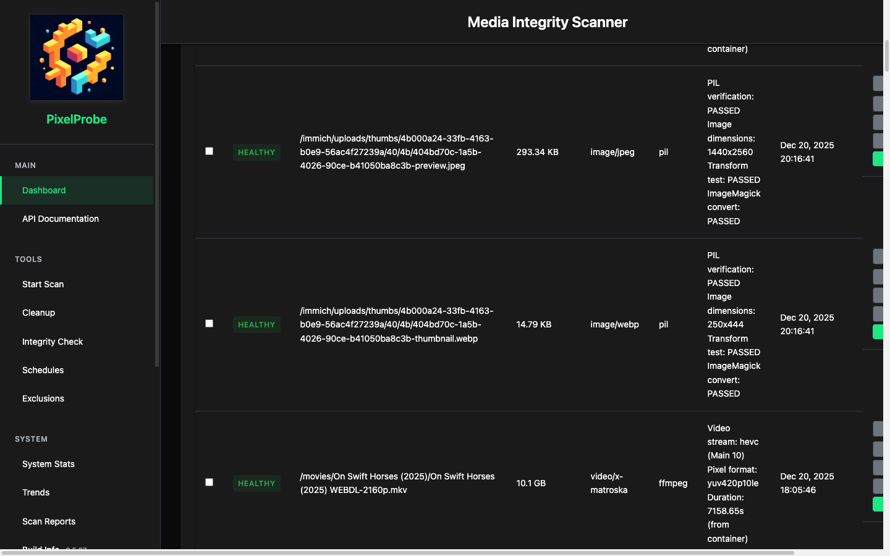
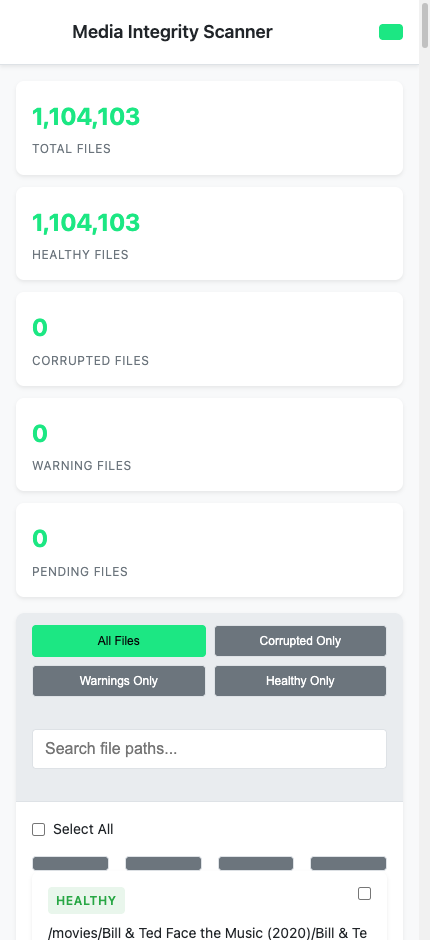
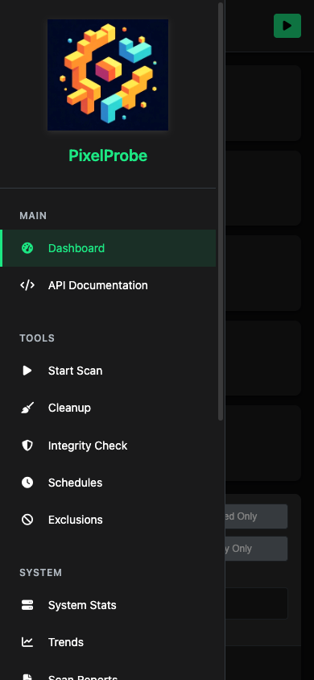
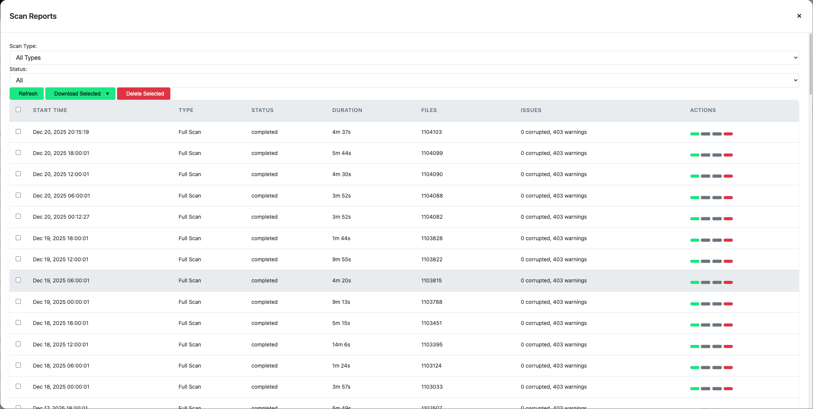
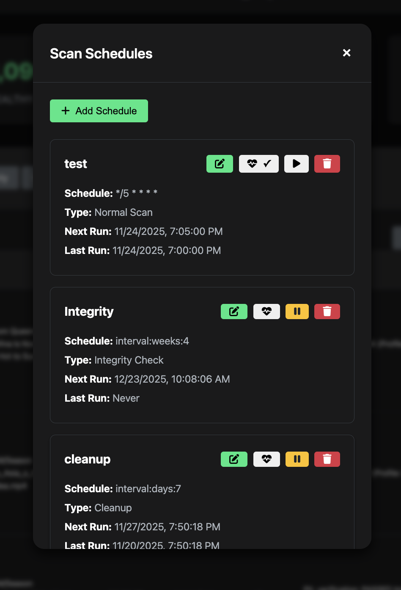

# PixelProbe

<div align="center">
  
</div>

## Overview

PixelProbe is a comprehensive media file corruption detection tool with a modern web interface. It helps you identify and manage corrupted video, image, and audio files across your media libraries.

**Version 2.4.34** - Critical fix for SQLAlchemy concurrent session errors during parallel scanning.

### Why PixelProbe?

- **Protect Your Media**: Automatically detect corrupted files before they cause playback issues
- **Save Time**: Batch scan entire media libraries instead of checking files individually  
- **Prevent Data Loss**: Identify failing drives by detecting corruption patterns
- **Professional Grade**: Uses industry-standard tools (FFmpeg, ImageMagick) for accurate detection
- **Set and Forget**: Schedule automated scans to continuously monitor your media health

## What's New in Version 2.4.34

### Parallel Scanning
- **Thread-safe database access**: Fixed SQLAlchemy concurrent session errors during parallel file scanning
- **Performance improvements**: Maintains parallel scanning speed while ensuring data integrity
- **Production tested**: Verified against real-world production workloads

### Authentication & Security
- **Multi-user support**: Role-based access control with admin privileges
- **Secure password storage**: Bcrypt hashing with minimum 8 character passwords
- **API token authentication**: Generate and manage tokens for programmatic access
- **Session management**: Cookie-based sessions with CSRF protection
- **First-run setup**: Secure admin account creation wizard

### Scanning Features
- **Parallel file processing**: Configurable worker threads (10-24 workers recommended)
- **Multiple scan types**: Full scan, orphan cleanup, file changes detection
- **Real-time progress**: Live updates with ETA calculations
- **Scheduled scans**: Automated scanning with cron expressions or intervals
- **Smart exclusions**: Configure paths and file extensions to skip

### Reporting & Monitoring
- **Comprehensive reports**: PDF and JSON export for scan results
- **Scan history**: Complete audit trail of all operations
- **System statistics**: Real-time monitoring of scan performance
- **Detailed file info**: File hash, corruption status, scan timestamps

## Features

### Media Support
- Comprehensive video format support (MP4, MKV, AVI, MOV, WebM, FLV, etc.)
- Image format detection (JPEG, PNG, GIF, BMP, TIFF, WebP, etc.)
- Audio file validation (MP3, FLAC, WAV, AAC, OGG, etc.)
- Large file support (tested with 50GB+ Bluray remux files)

### Detection Capabilities
- FFmpeg-based deep video analysis
- ImageMagick and PIL image validation
- Smart warning system for minor issues vs critical corruption
- Multi-stage detection with configurable thresholds
- Automatic retry logic for transient failures

### Scanning Features
- Parallel multi-threaded scanning with real-time progress
- Phase-based scanning (discovery → database → validation)
- Multiple scan types (normal, orphan cleanup, file changes)
- Scheduled automated scans with cron or interval support
- Configurable path and extension exclusions
- Bulk operations for rescanning and deep analysis

### Web Interface
- Modern responsive design with dark/light theme support
- Real-time scan progress with WebSocket updates
- Advanced filtering and search capabilities
- Bulk file selection and management
- Mobile-optimized touch interface
- Detailed file corruption reports

### System Features
- PostgreSQL database for reliable persistence
- Redis-backed task queue for background processing
- Celery worker pool for distributed scanning
- Docker deployment with multi-container architecture
- Comprehensive REST API with OpenAPI documentation
- Detailed system statistics and monitoring

### Security & Authentication
- Multi-user support with role-based access control
- Secure password storage with bcrypt hashing
- API token authentication for programmatic access
- Session-based web authentication with CSRF protection
- First-run setup wizard for initial configuration
- Audit logging for security events

## Screenshots

### Authentication & User Management

#### Login Screen


Secure login interface with:
- Username/password authentication
- Remember me functionality
- Dark mode support
- First-run setup detection

#### User Management


Comprehensive user administration:
- Create new users with email and admin privileges
- View and manage existing users
- Delete user accounts (admin only)
- Role-based access control

#### API Token Management


Programmatic access management:
- Generate API tokens with descriptions
- Optional expiration dates
- View and revoke existing tokens
- Bearer token authentication

#### Password Management


Secure password changes:
- Current password verification
- New password confirmation
- Minimum 8 character requirement
- Bcrypt hashing for security

### Desktop Interface

#### Light Mode


Features visible in the interface:
- **Statistics Dashboard**: Real-time display of 1M+ scanned files with health status
- **Sidebar Navigation**: Quick access to Dashboard, API Documentation, Tools (Start Scan, Cleanup, Check Changes, Schedules, Exclusions), System (Stats, Reports, Build Info), and Account (User Management, API Tokens, Change Password)
- **File Results Table**: Sortable columns for status, file path, size, type, scan date with bulk actions
- **Filtering Options**: All Files, Corrupted Only, Warnings Only, Healthy Only
- **Action Buttons**: Mark as Good, Rescan, Download, Export functionality

#### Dark Mode


Dark mode features:
- **High Contrast Theme**: Green accent colors for better visibility in low-light environments
- **Full Feature Parity**: All light mode features available with optimized dark color scheme
- **Persistent Theme**: Settings toggle remembers preference across sessions
- **Account Section**: Shows logged-in user (admin) with logout option

### Mobile Interface

<div align="center">
  
  
</div>

The mobile interface is fully responsive and touch-optimized:
- Adaptive layout that works on all screen sizes
- Touch-friendly buttons and controls
- Collapsible sidebar navigation
- Card-based design for scan results on mobile

### Advanced Features

#### Scan Reports


Comprehensive scan reporting with history and analytics:
- View all past scan operations with detailed statistics
- Filter by scan type (full scan, rescan, deep scan, cleanup, file changes)
- Export reports as JSON for data analysis or PDF for documentation

#### Scheduled Scanning


Create and manage automated scan schedules:
- Support for both cron expressions and simple intervals
- Multiple scan types: Normal Scan, Orphan Cleanup, File Changes
- View next run times and last execution status

##  Quick Start

### Using Docker (Recommended)

1. **Clone the repository**:
   ```bash
   git clone https://github.com/ttlequals0/PixelProbe.git
   cd PixelProbe
   ```

2. **Configure environment variables**:
   ```bash
   cp .env.example .env
   ```
   Edit `.env` and set required variables:
   ```bash
   # Generate a secure secret key
   python -c "import secrets; print(secrets.token_hex(32))"
   
   # Edit .env file with your values
   SECRET_KEY=your-generated-secret-key-here
   MEDIA_PATH=/path/to/your/actual/media/directory
   SCAN_PATHS=/media
   ```

3. **Start the application**:
   ```bash
   docker-compose up -d
   ```

4. **Access the web interface**:
   Open http://localhost:5001 in your browser

5. **Initial Setup** (IMPORTANT - First Run Only):

   On first run, you must create the admin account via the setup endpoint:

   ```bash
   # Create admin user with your chosen password
   curl -X POST http://localhost:5001/api/auth/setup \
     -H "Content-Type: application/json" \
     -d '{"password":"YourSecurePassword123"}'
   ```

   Or visit http://localhost:5001/login and follow the first-run setup wizard.

   **Security Note**: No default admin account exists. You must explicitly create it on first run.

6. **Start scanning**:
   - After login, click "Scan All Files" to begin analyzing your media library
   - Configure exclusions and schedules as needed

### Docker Image Versions

PixelProbe is available on Docker Hub as `ttlequals0/pixelprobe`:

- **`ttlequals0/pixelprobe:latest`** - Latest stable release (v2.4.34)
- **`ttlequals0/pixelprobe:2.4.34`** - Critical bug fix for parallel scanning thread safety
- **`ttlequals0/pixelprobe:2.4.30`** - Fixed Celery race condition with distributed locking
- **`ttlequals0/pixelprobe:2.4.0`** - Complete authentication system with user management

##  Requirements

**Important**: PixelProbe requires PostgreSQL. SQLite is no longer supported.

### Quick Migration from SQLite

1. **Backup your data**:
   ```bash
   cp /path/to/instance/pixelprobe.db /path/to/instance/pixelprobe.db.backup
   ```

2. **Update Docker Compose** - Add PostgreSQL and Redis services:
   ```yaml
   services:
     postgres:
       image: postgres:15-alpine
       environment:
         POSTGRES_DB: pixelprobe
         POSTGRES_USER: pixelprobe
         POSTGRES_PASSWORD: ${POSTGRES_PASSWORD}
       volumes:
         - postgres_data:/var/lib/postgresql/data
   
     mediachecker:
       image: ttlequals0/pixelprobe:2.4.0
       environment:
         POSTGRES_HOST: postgres
         POSTGRES_PASSWORD: ${POSTGRES_PASSWORD}
         # ... other settings
   ```

3. **Run migration**:
   ```bash
   docker-compose up -d postgres
   sleep 15
   
   # Migrate existing SQLite data
   docker run --rm \
     --network pixelprobe_pixelprobe-network \
     -v "/path/to/instance/pixelprobe.db:/app/pixelprobe.db:ro" \
     -e POSTGRES_HOST=postgres \
     -e POSTGRES_PASSWORD=$POSTGRES_PASSWORD \
     ttlequals0/pixelprobe:2.4.0 \
     python migrate_to_postgres.py --sqlite-path /app/pixelprobe.db
   ```

For detailed migration instructions, see [MIGRATION_v2.2.0.md](MIGRATION_v2.2.0.md).

## Documentation

### Quick Links
- **[Docker Setup Guide](docs/DOCKER_SETUP.md)** - Complete Docker Compose setup with container explanations
- **[System Architecture](docs/SYSTEM_ARCHITECTURE.md)** - Container architecture, Celery queues, and data flow
- **[API Documentation](docs/api/README.md)** - Complete REST API reference  
- **[Architecture Overview](docs/ARCHITECTURE.md)** - Application layers and design
- **[Performance Tuning](docs/PERFORMANCE_TUNING.md)** - Optimization strategies
- **[Developer Guide](docs/developer/README.md)** - Development setup and guidelines

### API Client Examples
- **[Python Client](docs/examples/python-client.py)** - Full-featured Python client with CLI
- **[Node.js Client](docs/examples/nodejs-client.js)** - JavaScript/Node.js client implementation
- **[Bash Client](docs/examples/bash-client.sh)** - Shell script client using curl and jq

## Configuration

### Environment Variables

PixelProbe uses environment variables for all configuration. Copy `.env.example` to `.env` and customize:

**Required Variables:**
- `SECRET_KEY` - Secure secret key for Flask sessions
- `MEDIA_PATH` - Host path to your media files (for Docker volume mounting)

**Optional Variables:**
- `SCAN_PATHS` - Comma-separated directories to monitor inside container (default: `/media`)
- `TZ` - Timezone (default: UTC)
- `MAX_WORKERS` - Parallel file scanning workers (default: 10, recommended: 10-24)
  * Controls parallelism within each scan task
  * Higher values = faster scans but more CPU/memory usage
  * Each worker creates 1 database connection
  * Total connections = 60 (main app) + MAX_WORKERS
- `BATCH_SIZE` - Files per batch during discovery (default: 100)
- `CELERY_CONCURRENCY` - Concurrent Celery tasks (default: 4)
  * Controls how many scan tasks can run simultaneously
  * Independent from MAX_WORKERS
- `PERIODIC_SCAN_SCHEDULE` - Automated scanning schedule
- `CLEANUP_SCHEDULE` - Automated cleanup schedule
- `EXCLUDED_PATHS` - Paths to ignore during scanning
- `EXCLUDED_EXTENSIONS` - File extensions to ignore

See `.env.example` for complete configuration options with examples.

### Multiple Scan Paths

You can configure multiple directories to scan:

**Method 1: Docker Compose with Multiple Volumes**
```yaml
environment:
  - SCAN_PATHS=/movies,/tv-shows,/backup
volumes:
  - /mnt/movies:/movies
  - /mnt/tv-shows:/tv-shows  
  - /mnt/backup:/backup
```

**Method 2: Single Volume with Subdirectories**
```bash
export MEDIA_PATH=/mnt/all-media  # Contains subdirs: movies/, tv/, backup/
# docker-compose.yml uses: SCAN_PATHS=/media/movies,/media/tv,/media/backup
```

## Usage

### Web Interface

1. **Access the Dashboard**: Navigate to http://localhost:5001
2. **Start a Scan**: Click "Scan All Files" to begin scanning your media directories
3. **View Results**: Results appear in the table below with corruption status
4. **Filter Results**: Use the filter buttons to show only corrupted or healthy files
5. **File Actions**: 
   - **Rescan**: Re-examine a specific file
   - **Download**: Download the file to your local machine
6. **Schedules**: Manage automated scan schedules with multiple scan types
7. **Exclusions**: Interactive management of paths and extensions to exclude

### API Documentation

PixelProbe provides a comprehensive REST API with OpenAPI/Swagger documentation.

#### Interactive API Documentation
- **Swagger UI**: Available at `/api/v1/docs` when logged in
- **OpenAPI Spec**: Full API specification with request/response schemas
- **Try it out**: Test endpoints directly from the documentation

#### Authentication Endpoints
- `GET /api/auth/status` - Check authentication status
- `POST /api/auth/login` - User login
- `POST /api/auth/logout` - User logout
- `POST /api/auth/setup` - First-run admin setup
- `GET /api/auth/users` - List all users (admin only)
- `POST /api/auth/users` - Create new user (admin only)
- `DELETE /api/auth/users/{id}` - Delete user (admin only)
- `PUT /api/auth/users/{id}/password` - Change user password
- `GET /api/auth/tokens` - List user's API tokens
- `POST /api/auth/tokens` - Create new API token
- `DELETE /api/auth/tokens/{id}` - Revoke API token

#### Scanning Endpoints
- `GET /api/stats` - Get scanning statistics
- `GET /api/scan-results` - Get paginated scan results with filtering
- `POST /api/scan` - Start a directory scan
- `POST /api/scan/parallel` - Start parallel scan with Celery
- `GET /api/scan-status` - Get current scan progress
- `POST /api/cancel-scan` - Cancel running scan
- `POST /api/rescan-file` - Rescan specific file
- `POST /api/deep-scan` - Perform deep analysis

#### Maintenance Endpoints
- `POST /api/cleanup` - Remove orphaned database entries
- `GET /api/cleanup-status` - Get cleanup operation status
- `POST /api/file-changes` - Detect file system changes
- `GET /api/file-changes-status` - Get file changes scan status
- `POST /api/reset-for-rescan` - Reset files for rescanning
- `POST /api/reset-files-by-path` - Reset specific files by path

#### Schedule Management
- `GET /api/schedules` - List all scan schedules
- `POST /api/schedules` - Create new schedule
- `PUT /api/schedules/{id}` - Update schedule
- `DELETE /api/schedules/{id}` - Delete schedule
- `GET /api/schedule-types` - Get available schedule types

#### System Configuration
- `GET /api/exclusions` - Get path and extension exclusions
- `PUT /api/exclusions` - Update exclusions
- `GET /api/ignored-errors` - Get ignored error patterns
- `POST /api/ignored-errors` - Add ignored error pattern
- `DELETE /api/ignored-errors/{id}` - Remove error pattern

#### Data Export
- `POST /api/export` - Export scan results (CSV, JSON, Excel)
- `GET /api/reports` - List generated reports
- `GET /api/reports/{filename}` - Download specific report

### API Authentication

#### Session Authentication (Web UI)
```javascript
// Login via web form
fetch('/api/auth/login', {
    method: 'POST',
    headers: {'Content-Type': 'application/json'},
    body: JSON.stringify({
        username: 'admin',
        password: 'your_password'
    }),
    credentials: 'include'
});
```

#### Bearer Token Authentication (API)
```python
import requests

# Create API token via web UI or API
headers = {
    'Authorization': 'Bearer your_api_token_here'
}

# Make authenticated API request
response = requests.get(
    'http://localhost:5000/api/stats',
    headers=headers
)
```

#### cURL Examples
```bash
# Login and get session cookie
curl -X POST http://localhost:5000/api/auth/login \
  -H "Content-Type: application/json" \
  -d '{"username":"admin","password":"password"}' \
  -c cookies.txt

# Use session cookie for requests
curl http://localhost:5000/api/stats -b cookies.txt

# Or use API token
curl http://localhost:5000/api/stats \
  -H "Authorization: Bearer your_api_token_here"
```

### Command Line Usage

```python
from media_checker import PixelProbe

checker = PixelProbe()

# Scan a single file
result = checker.scan_file('/path/to/media/file.mp4')
print(f"Corrupted: {result['is_corrupted']}")

# Scan multiple directories
results = checker.scan_directories(['/path/to/media1', '/path/to/media2'])
for result in results:
    if result['is_corrupted']:
        print(f"Corrupted file: {result['file_path']}")
```

## Supported File Formats

### Video Formats
- **Common**: MP4, MKV, AVI, MOV, WMV, FLV, WebM, M4V
- **HEVC/H.265**: HEVC, H265 
- **Professional**: ProRes, MXF, DNxHD, DNxHR
- **Broadcast**: MTS, M2TS, AVCHD
- **Legacy**: MPG, MPEG, VOB, RM, RMVB

### Image Formats
- **Common**: JPEG, PNG, GIF, BMP, TIFF, WebP
- **Apple**: HEIC, HEIF
- **RAW Formats**: CR2, CR3, NEF, NRW, ARW, DNG, ORF, RW2, PEF, RAF

### Audio Formats
- **Lossy**: MP3, AAC, M4A, WMA, OGG, OGA, Opus
- **Lossless**: FLAC, WAV, AIFF, APE, WV
- **High-Resolution**: DSF, DFF (DSD)
- **Dolby/DTS**: AC3, DTS

## Development

### Development Setup

1. **Clone the repository**:
   ```bash
   git clone https://github.com/ttlequals0/PixelProbe.git
   cd PixelProbe
   ```

2. **Use development compose file**:
   ```bash
   docker-compose -f docker-compose.dev.yml up -d
   ```

### Testing

```bash
# Install test dependencies
pip install -r requirements-test.txt

# Run all tests
pytest

# Run with coverage report
pytest --cov=pixelprobe --cov-report=html

# Run specific test categories
pytest tests/unit/           # Unit tests only
pytest tests/integration/    # Integration tests only
```

### Contributing

1. Fork the repository
2. Create a feature branch
3. Make your changes
4. Add tests if applicable
5. Submit a pull request

## Troubleshooting

### Database Errors After Updates

If you encounter **"no such table: scan_results"** errors after upgrading:

```bash
# Quick fix
docker exec pixelprobe python tools/fix_database_schema.py
```

### Common Issues

**FFmpeg/ImageMagick not found**:
- Ensure FFmpeg and ImageMagick are installed and in PATH
- On Ubuntu/Debian: `sudo apt-get install ffmpeg imagemagick`
- On macOS: `brew install ffmpeg imagemagick`

**Permission errors**:
- Ensure the application has read access to your media directories
- Check file permissions and ownership

**Performance issues with large libraries**:
- Increase `MAX_WORKERS` (default: 10, try 16-24 for powerful systems)
- Monitor system resources during scanning
- Use SSD storage for the database if possible
- Adjust `CELERY_CONCURRENCY` if running multiple scans simultaneously

### Getting Help

1. **Check logs first**: `docker logs pixelprobe` 
2. **Search existing issues**: [GitHub Issues](https://github.com/ttlequals0/PixelProbe/issues)
3. **Create new issue**: Include logs and system info

## License

This project is licensed under the MIT License - see the LICENSE file for details.

## Acknowledgments

- [FFmpeg](https://ffmpeg.org/) for video analysis
- [ImageMagick](https://imagemagick.org/) for image processing
- [PIL/Pillow](https://pillow.readthedocs.io/) for Python image handling
- Inspired by media integrity checkers and corruption detectors

## Support

For issues, questions, or contributions, please visit the [GitHub repository](https://github.com/ttlequals0/PixelProbe/issues).