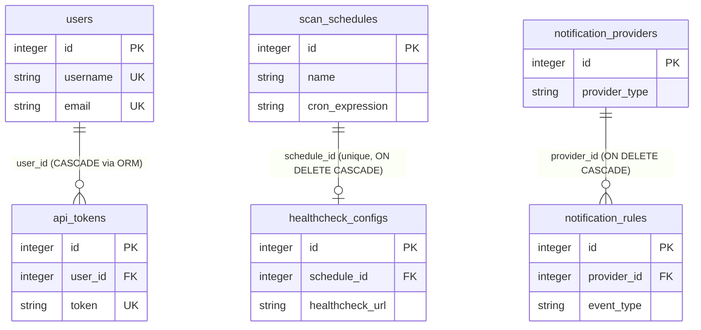

# Database schema

PixelProbe uses PostgreSQL exclusively (since v2.2.0; SQLite is not supported).
All 17 models live in `pixelprobe/models.py`. Tables are created by
`db.create_all()` at startup and evolved by idempotent migrations in
`pixelprobe/migrations/startup.py` (see Migration notes below).

Type notes:

- `DateTime` columns map to `TIMESTAMP WITHOUT TIME ZONE`; the app stores UTC
  and pins the PostgreSQL session timezone to UTC (`pixelprobe/config.py`).
- `DateTime(tz)` below means `DateTime(timezone=True)` (`TIMESTAMPTZ`).
- `JSON` is the native SQLAlchemy JSON type; "JSON in Text" means a JSON
  string stored in a `Text` column.

## Entity relationship diagram

Only three real foreign keys exist in the schema:



Everything else is unrelated at the database level. In particular:

- `scan_reports.scan_id` is a loose string reference to `scan_state.scan_id`,
  NOT a foreign key. No constraint enforces it, and reports outlive scan state
  rows.
- `scan_chunks.scan_id` and `log_entries.scan_id` are likewise plain strings
  matching `scan_state.scan_id` by convention only.

## Core tables

### ScanResult (`scan_results`)

One row per discovered media file; the largest table (millions of rows on big
libraries).

| Column | Type | Nullable | Notes |
|---|---|---|---|
| id | Integer | PK | |
| file_path | String(500) | no | Unique, indexed |
| file_size | BigInteger | yes | NULL during discovery |
| file_type | String(50) | yes | NULL during discovery |
| creation_date | DateTime | yes | NULL during discovery |
| is_corrupted | Boolean | yes | Tri-state: NULL = not scanned yet, TRUE = corrupted, FALSE = healthy. Indexed |
| corruption_details | Text | yes | |
| scan_date | DateTime | yes | NULL = not scanned yet. Indexed |
| marked_as_good | Boolean | no | Default FALSE. User override. Indexed |
| scan_status | String(20) | yes | pending, scanning, completed, error, skipped. Default 'pending'. Indexed |
| discovered_date | DateTime | yes | Indexed |
| file_hash | String(64) | yes | SHA-256 for change detection. Indexed |
| last_modified | DateTime | yes | Filesystem mtime. Indexed |
| last_integrity_check_date | DateTime | yes | Indexed |
| scan_tool | String(50) | yes | ffmpeg, imagemagick, pil |
| scan_duration | Float | yes | Seconds |
| scan_output | Text | yes | Rotated to MAX_OUTPUT_SIZE (default 10000 chars) |
| has_warnings | Boolean | no | Default FALSE. Indexed |
| warning_details | Text | yes | |
| error_message | Text | yes | |
| media_info | Text | yes | JSON in Text |
| file_exists | Boolean | no | Default TRUE. Indexed |
| bitrot_suspected | Boolean | no | Default FALSE. Hash mismatch with unchanged mtime. Auto-expires after stable checks. Indexed |
| bitrot_detected_date | DateTime | yes | Permanent once set |
| bitrot_details | Text | yes | JSON in Text: stored vs current hash/mtime/size |
| bitrot_candidate_hash | String(64) | yes | Stability reference for auto-expire |
| bitrot_stable_checks | Integer | no | Default 0 |
| mtime_baseline_utc | Boolean | no | Default FALSE. TRUE once mtime written as UTC (post-v2.6.61) |
| deep_scan | Boolean | yes | Legacy, kept for backward compatibility |
| output_rotation_enabled | Boolean | yes | Per-record rotation override |

Composite indexes declared in the model (`__table_args__`):
`idx_status_corrupted (scan_status, is_corrupted)`,
`idx_scan_date_corrupted (scan_date, is_corrupted)`,
`idx_exists_status (file_exists, scan_status)`.

### ScanState (`scan_state`)

Progress and lifecycle of a scan run. One row per scan; the active scan has
`is_active = TRUE`.

| Column | Type | Nullable | Notes |
|---|---|---|---|
| id | Integer | PK | |
| scan_id | String(64) | no | Unique. UUID, or 'scheduled_N' for scheduled scans |
| is_active | Boolean | no | Default TRUE |
| phase | String(20) | no | idle, discovering, adding, scanning, completed (also cancelled, error, interrupted) |
| phase_number | Integer | no | Default 0 |
| phase_current | Integer | no | Default 0 |
| phase_total | Integer | no | Default 0. Never reset to 0 once positive (avoids "x of 0" UI bug) |
| files_processed | Integer | no | Default 0 |
| estimated_total | Integer | no | Default 0. Same never-reset-to-0 rule |
| discovery_count | Integer | no | Default 0 |
| start_time | DateTime | no | Default now (UTC) |
| end_time | DateTime | yes | |
| current_file | String(500) | yes | |
| progress_message | String(1000) | yes | |
| error_message | String(1000) | yes | |
| directories | Text | yes | JSON in Text: array of scan roots |
| force_rescan | Boolean | no | Default FALSE |
| scan_type | String(20) | yes | full, parallel, pending |
| celery_task_id | String(36) | yes | Orchestrator task id. Indexed |
| current_chunk_index | Integer | no | Default 0 |
| total_chunks | Integer | no | Default 0 |
| chunks_completed | Text | yes | JSON in Text: completed chunk IDs |
| last_update | DateTime | yes | See semantics note below |
| num_workers | Integer | no | Default 1 |
| files_added | Integer | no | Default 0 |
| files_updated | Integer | no | Default 0 |

`last_update` semantics changed in v2.7.3: chunk tasks now heartbeat it
periodically while working, so it is a liveness signal, not the time the last
file finished. Stuck-scan detection and stale-scan cleanup
(`create_new_scan()` deactivates active scans only when `last_update` is older
than 30 minutes) rely on this.

### ScanChunk (`scan_chunks`)

Unit of work for the chunked scan engine. Chunk tasks outlive the
orchestrator task; `ScanChunk.has_active()` is the source of truth for
"scan still running".

| Column | Type | Nullable | Notes |
|---|---|---|---|
| id | Integer | PK | |
| scan_id | String(64) | no | Matches scan_state.scan_id (string link, no FK). Indexed |
| chunk_id | String(100) | no | Indexed. Unique per scan via `uq_scan_chunks_scan_chunk (scan_id, chunk_id)` |
| directory_path | Text | no | Real directory path, or FCP path-range JSON `{"t":"FCP","f":...,"l":...}` |
| phase | String(20) | no | discovering, adding, scanning. Default 'scanning' |
| status | String(20) | no | pending, processing, completed, error. Default 'pending' |
| files_discovered | Integer | no | Default 0 |
| files_added | Integer | no | Default 0 |
| files_scanned | Integer | no | Default 0 |
| files_processed | Integer | no | Default 0 |
| is_complete | Boolean | no | Default FALSE |
| start_time | DateTime | yes | |
| end_time | DateTime | yes | |
| error_message | Text | yes | |
| celery_task_id | String(36) | yes | Indexed |

### ScanReport (`scan_reports`)

Summary record written per scan/cleanup/file-changes operation.

| Column | Type | Nullable | Notes |
|---|---|---|---|
| id | Integer | PK | |
| report_id | String(36) | no | Unique UUID |
| scan_type | String(50) | no | full_scan, rescan, cleanup, file_changes |
| start_time | DateTime(tz) | no | |
| end_time | DateTime(tz) | yes | |
| duration_seconds | Float | yes | |
| directories_scanned | Text | yes | JSON in Text |
| force_rescan | Boolean | no | Default FALSE |
| num_workers | Integer | no | Default 1 |
| total_files_discovered | Integer | no | Default 0 |
| files_scanned | Integer | no | Default 0 |
| files_added | Integer | no | Default 0 |
| files_updated | Integer | no | Default 0 |
| files_corrupted | Integer | no | Default 0 |
| files_with_warnings | Integer | no | Default 0 |
| files_error | Integer | no | Default 0 |
| orphaned_records_found | Integer | no | Default 0 (cleanup runs) |
| orphaned_records_deleted | Integer | no | Default 0 (cleanup runs) |
| files_changed | Integer | no | Default 0 (file_changes runs) |
| files_corrupted_new | Integer | no | Default 0 (file_changes runs) |
| status | String(20) | no | running, completed, error, cancelled. Default 'running' |
| error_message | Text | yes | |
| scan_id | String(64) | yes | Loose string link to scan_state.scan_id, NOT an FK |
| created_at | DateTime(tz) | no | Default now (UTC) |

## Configuration tables

### ScanConfiguration (`scan_configurations`)

Dual-shape table supporting two record forms:

- Legacy key/value form: `key` + `value` (+ `description`, `updated_date`),
  `path` is NULL.
- Current path form: `path` set, used as a configured scan directory.

`to_dict()` picks the shape based on whether `path` is set.

| Column | Type | Nullable | Notes |
|---|---|---|---|
| id | Integer | PK | |
| key | String(50) | yes | Unique. Legacy form |
| value | Text | yes | Legacy form |
| description | String(200) | yes | Legacy form |
| updated_date | DateTime | yes | Legacy form |
| path | String(500) | yes | Unique. Path form |
| is_active | Boolean | no | Default TRUE |
| created_at | DateTime(tz) | yes | |

### Exclusion (`exclusions`)

| Column | Type | Nullable | Notes |
|---|---|---|---|
| id | Integer | PK | |
| exclusion_type | String(20) | no | 'path' or 'extension'. The API serializes this as `type` in JSON; the DB column is `exclusion_type` |
| value | String(500) | no | |
| created_at | DateTime(tz) | no | |
| is_active | Boolean | no | Default TRUE |

Unique constraint: `_type_value_uc (exclusion_type, value)`.

### IgnoredErrorPattern (`ignored_error_patterns`)

| Column | Type | Nullable | Notes |
|---|---|---|---|
| id | Integer | PK | |
| pattern | String(200) | no | Unique |
| description | String(500) | yes | |
| created_at | DateTime(tz) | no | |
| created_date | DateTime | no | Legacy duplicate kept for backward compatibility |
| is_active | Boolean | no | Default TRUE |

### ScanSchedule (`scan_schedules`)

Schedules are cron-only (`cron_expression`); there are no interval/period
columns.

| Column | Type | Nullable | Notes |
|---|---|---|---|
| id | Integer | PK | |
| name | String(100) | no | |
| cron_expression | String(50) | no | |
| scan_paths | Text | yes | JSON in Text: array of paths |
| scan_type | String(20) | no | normal, orphan, file_changes. Default 'normal' |
| force_rescan | Boolean | no | Default FALSE |
| time_budget_minutes | Integer | yes | file_changes only: stop dispatching new hash tasks after N minutes; NULL = unlimited. Rolling queue resumes next run |
| is_active | Boolean | no | Default TRUE |
| last_run | DateTime | yes | |
| next_run | DateTime | yes | |
| created_at | DateTime(tz) | no | |
| created_date | DateTime | no | Legacy duplicate |

### HealthcheckConfig (`healthcheck_configs`)

1:1 with a schedule (unique FK, ON DELETE CASCADE). Pings a healthcheck URL
around scheduled runs.

| Column | Type | Nullable | Notes |
|---|---|---|---|
| id | Integer | PK | |
| schedule_id | Integer | no | FK -> scan_schedules.id, unique, indexed, ON DELETE CASCADE |
| healthcheck_url | String(500) | no | |
| is_active | Boolean | no | Default TRUE |
| send_start_ping | Boolean | no | Default TRUE |
| send_success_ping | Boolean | no | Default TRUE |
| send_failure_ping | Boolean | no | Default TRUE |
| include_report_data | Boolean | no | Default TRUE |
| last_ping_status | String(20) | yes | success, failure, timeout |
| last_ping_time | DateTime(tz) | yes | |
| created_at | DateTime(tz) | no | |
| updated_at | DateTime(tz) | no | Auto-updated |

### AppConfig (`app_configs`)

Application-level key/value settings stored in the database.

| Column | Type | Nullable | Notes |
|---|---|---|---|
| id | Integer | PK | |
| key | String(100) | no | Unique |
| value | Text | no | |
| description | String(500) | yes | |
| created_at | DateTime(tz) | no | server_default NOW() |
| updated_at | DateTime(tz) | no | server_default NOW(), auto-updated |

## State tables

Both use an integer PK plus a separate UUID string column for external
reference (the UUID is not the primary key).

### CleanupState (`cleanup_state`)

| Column | Type | Nullable | Notes |
|---|---|---|---|
| id | Integer | PK | |
| cleanup_id | String(36) | no | Unique UUID |
| is_active | Boolean | no | Default TRUE |
| phase | String(20) | no | idle, checking, deleting, complete, error, cancelled |
| phase_number | Integer | no | Default 1 |
| phase_current | Integer | no | Default 0 |
| phase_total | Integer | no | Default 0 |
| files_processed | Integer | no | Default 0 |
| total_files | Integer | no | Default 0 |
| orphaned_found | Integer | no | Default 0 |
| start_time | DateTime(tz) | yes | |
| end_time | DateTime(tz) | yes | |
| current_file | String(500) | yes | |
| progress_message | String(1000) | yes | |
| error_message | String(1000) | yes | |
| cancel_requested | Boolean | yes | Default FALSE |

### FileChangesState (`file_changes_state`)

| Column | Type | Nullable | Notes |
|---|---|---|---|
| id | Integer | PK | |
| check_id | String(36) | no | Unique UUID |
| is_active | Boolean | no | Default TRUE |
| phase | String(20) | no | idle, starting, checking_hashes, verifying_changes, complete, error, cancelled |
| phase_number | Integer | no | Default 1 |
| phase_current | Integer | no | Default 0 |
| phase_total | Integer | no | Default 0 |
| files_processed | Integer | no | Default 0 |
| total_files | Integer | no | Default 0 |
| changes_found | Integer | no | Default 0 |
| corrupted_found | Integer | no | Default 0 |
| start_time | DateTime(tz) | yes | |
| end_time | DateTime(tz) | yes | |
| last_heartbeat | DateTime(tz) | yes | Liveness signal for stuck-worker detection |
| current_file | String(500) | yes | |
| progress_message | String(1000) | yes | |
| error_message | String(1000) | yes | |
| changed_files | Text | yes | JSON in Text: list of changed files |
| cancel_requested | Boolean | yes | Default FALSE |

## Authentication tables

### User (`users`)

| Column | Type | Nullable | Notes |
|---|---|---|---|
| id | Integer | PK | |
| username | String(80) | no | Unique, indexed |
| email | String(120) | no | Unique, indexed |
| password_hash | String(128) | no | bcrypt |
| is_admin | Boolean | no | Default TRUE (all users are admins) |
| created_at | DateTime(tz) | no | |
| last_login | DateTime(tz) | yes | |
| is_active | Boolean | no | Default TRUE |
| first_setup_required | Boolean | no | Default FALSE |

### APIToken (`api_tokens`)

| Column | Type | Nullable | Notes |
|---|---|---|---|
| id | Integer | PK | |
| user_id | Integer | no | FK -> users.id (delete cascades via ORM relationship) |
| token | String(64) | no | Unique, indexed. `secrets.token_urlsafe(48)` |
| description | String(200) | yes | |
| created_at | DateTime(tz) | no | |
| last_used | DateTime(tz) | yes | Write throttled to once per 5 minutes per token |
| expires_at | DateTime(tz) | yes | NULL = never expires |
| is_active | Boolean | no | Default TRUE |

## Notification tables

### NotificationProvider (`notification_providers`)

| Column | Type | Nullable | Notes |
|---|---|---|---|
| id | Integer | PK | |
| name | String(100) | no | |
| provider_type | String(20) | no | pushover, ntfy, webhook, email. Indexed |
| is_active | Boolean | no | Default TRUE |
| configuration | JSON | no | Provider-specific config (secrets masked in API output) |
| created_at | DateTime(tz) | no | |
| updated_at | DateTime(tz) | no | Auto-updated |
| last_notification_status | String(20) | yes | success, failure |
| last_notification_time | DateTime(tz) | yes | |

### NotificationRule (`notification_rules`)

| Column | Type | Nullable | Notes |
|---|---|---|---|
| id | Integer | PK | |
| provider_id | Integer | no | FK -> notification_providers.id, indexed, ON DELETE CASCADE |
| event_type | String(50) | no | Indexed. scan_start, scan_complete, scan_failed, scan_missed, corruption_found, bitrot_suspected, user_added, user_deleted, api_key_added, api_key_deleted, auth_failed |
| is_active | Boolean | no | Default TRUE |
| priority | String(10) | no | low, normal, high. Default 'normal' |
| conditions | JSON | yes | Optional, e.g. `{"corrupted_count": ">0"}` |
| created_at | DateTime(tz) | no | |
| updated_at | DateTime(tz) | no | Auto-updated |

## Logging table

### LogEntry (`log_entries`)

Persistent log storage for the View Logs feature. Indexes are created by
migration, not by the model.

| Column | Type | Nullable | Notes |
|---|---|---|---|
| id | Integer | PK | |
| scan_id | String(64) | yes | Loose string link to scan_state.scan_id |
| celery_task_id | String(64) | yes | |
| timestamp | DateTime(tz) | no | |
| level | String(10) | no | |
| logger_name | String(200) | yes | |
| message | Text | no | |
| traceback | Text | yes | |

## Indexes

Single-column indexes declared with `index=True` in the models use
SQLAlchemy's default naming (`ix_<table>_<column>`). In addition, the
migrations in `pixelprobe/migrations/startup.py` create these named indexes:

`create_performance_indexes()` on `scan_results`:

| Index | Columns |
|---|---|
| idx_scan_status | scan_status |
| idx_scan_date | scan_date |
| idx_is_corrupted | is_corrupted |
| idx_marked_as_good | marked_as_good |
| idx_discovered_date | discovered_date |
| idx_file_hash | file_hash |
| idx_last_modified | last_modified |
| idx_file_path | file_path |
| idx_status_date | scan_status, scan_date |
| idx_corrupted_good | is_corrupted, marked_as_good |
| idx_file_path_status | file_path, scan_status |
| idx_status_file_path | scan_status, file_path |

Other migration-created indexes:

| Index | Table | Columns |
|---|---|---|
| idx_scan_results_last_integrity_check | scan_results | last_integrity_check_date |
| idx_scan_results_bitrot_suspected | scan_results | bitrot_suspected |
| idx_scan_results_integrity_queue | scan_results | bitrot_suspected DESC, last_integrity_check_date ASC NULLS FIRST, id ASC |
| idx_users_username | users | username |
| idx_users_email | users | email |
| idx_api_tokens_token | api_tokens | token |
| idx_api_tokens_user_id | api_tokens | user_id |
| idx_log_scan_timestamp | log_entries | scan_id, timestamp |
| idx_log_timestamp | log_entries | timestamp |
| idx_log_level | log_entries | level |
| idx_log_scan_id | log_entries | scan_id |
| idx_log_celery_task_id | log_entries | celery_task_id |

## Example queries (PostgreSQL)

`is_corrupted` is tri-state, so always decide how NULL (never scanned) should
be treated.

```sql
-- Corrupted files not marked as good
SELECT file_path, corruption_details
FROM scan_results
WHERE is_corrupted IS TRUE
  AND marked_as_good = FALSE;

-- Healthy scanned files (excludes never-scanned rows)
SELECT COUNT(*)
FROM scan_results
WHERE is_corrupted IS FALSE;

-- Files never scanned
SELECT COUNT(*)
FROM scan_results
WHERE is_corrupted IS NULL;

-- Files with warnings scanned in the last 7 days
SELECT file_path, warning_details
FROM scan_results
WHERE has_warnings = TRUE
  AND scan_date > NOW() - INTERVAL '7 days';

-- Suspected bitrot
SELECT file_path, bitrot_detected_date, bitrot_details
FROM scan_results
WHERE bitrot_suspected = TRUE;

-- Currently active scan
SELECT scan_id, phase, files_processed, estimated_total, last_update
FROM scan_state
WHERE is_active = TRUE;
```

## Migration notes

There is no Alembic. Schema changes are hand-written, idempotent migrations in
`pixelprobe/migrations/startup.py`, executed at every startup.

To add a column:

1. Add the column to the model in `pixelprobe/models.py`.
2. Add (or extend) a `run_vX_Y_Z_migrations(db)` function in
   `pixelprobe/migrations/startup.py` using idempotent DDL, e.g.
   `ALTER TABLE ... ADD COLUMN IF NOT EXISTS ...` or an
   `information_schema.columns` existence check.
3. Register the function in `_run_all_migrations()` (each migration is wrapped
   in its own try/except so one failure does not block the rest).

Execution model (`migrate_database()`):

- All migrations run under a PostgreSQL advisory lock
  (`MIGRATION_ADVISORY_LOCK_ID = 7283945162`) so only one process runs DDL
  when multiple gunicorn workers or containers start against the same
  database. Non-holders block until the holder finishes, bounded by
  `MIGRATION_STATEMENT_TIMEOUT_MS` (default 300000 ms).
- DDL timeouts (`MIGRATION_LOCK_TIMEOUT_MS`, default 10000 ms) make blocked
  DDL fail fast instead of wedging startup. Because every migration is
  idempotent, a timed-out migration simply retries on the next boot.

## Performance and connection pooling

Engine options from `pixelprobe/config.py` (`SQLALCHEMY_ENGINE_OPTIONS`):

| Setting | Value | Notes |
|---|---|---|
| pool_size | 5 | Env-tunable via DB_POOL_SIZE |
| max_overflow | 10 | Env-tunable via DB_MAX_OVERFLOW |
| pool_pre_ping | True | Validates connections before use |
| pool_recycle | 3600 s | Recycles idle connections hourly |
| pool_timeout | 30 s | Wait for a pooled connection |

Pool math must stay under PostgreSQL `max_connections` (default 100):
4 gunicorn workers x (5 + 10) = 60 maximum for the web app, plus Celery
prefork children and checker connections. The session timezone is pinned to
UTC via `connect_args` so naive `TIMESTAMP` columns always hold UTC wall time.

[< Documentation index](README.md)
