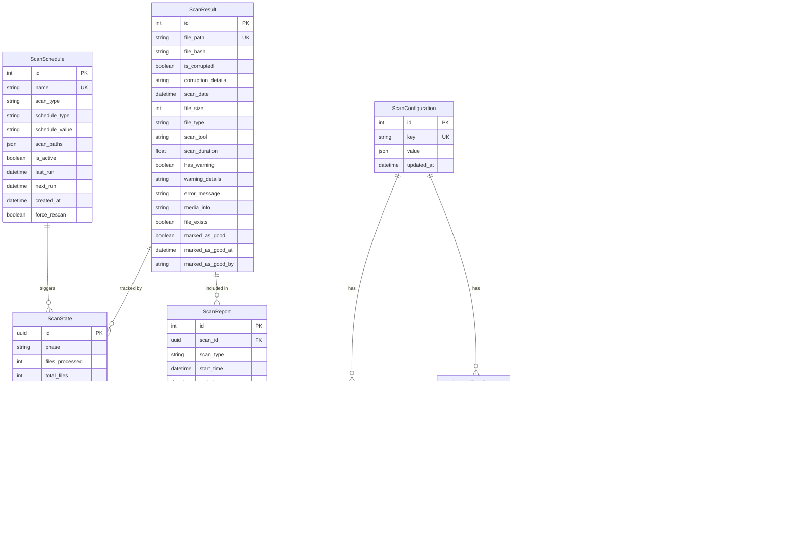

# Database Schema Documentation

## Overview

PixelProbe uses SQLAlchemy ORM with SQLite as the default database. The schema is designed to efficiently track media file scans, their results, and system configuration.

## Entity Relationship Diagram



## Table Descriptions

### Core Tables

#### ScanResult
The main table storing individual file scan results.
- **Primary Key**: `id` (auto-increment)
- **Unique Key**: `file_path` (ensures one record per file)
- **Indexes**: `file_path`, `is_corrupted`, `scan_date`, `marked_as_good`
- **Purpose**: Tracks the corruption status and metadata for each scanned file

#### ScanState
Tracks the progress of active and completed scan operations.
- **Primary Key**: `id` (UUID)
- **Purpose**: Real-time progress tracking and scan management
- **Usage**: Updated during scanning to show progress in UI

#### ScanReport
Historical record of completed scan operations.
- **Primary Key**: `id` (auto-increment)
- **Foreign Key**: `scan_id` references ScanState
- **Purpose**: Audit trail and analytics for all scan operations

### Configuration Tables

#### ScanSchedule
Manages automated scan scheduling.
- **Primary Key**: `id` (auto-increment)
- **Unique Key**: `name`
- **Purpose**: Cron-based or interval-based automated scanning

#### ScanConfiguration
Key-value store for application configuration.
- **Primary Key**: `id` (auto-increment)
- **Unique Key**: `key`
- **Purpose**: Flexible configuration storage

#### Exclusion
Paths and extensions to exclude from scanning.
- **Primary Key**: `id` (auto-increment)
- **Unique Key**: `(type, value)` composite
- **Types**: 'path' or 'extension'

#### IgnoredErrorPattern
Patterns to ignore in scan output to reduce false positives.
- **Primary Key**: `id` (auto-increment)
- **Unique Key**: `pattern`
- **Purpose**: Filter known non-critical errors

### Maintenance Tables

#### CleanupState
Tracks orphan cleanup operations.
- **Primary Key**: `id` (UUID)
- **Purpose**: Progress tracking for database cleanup

#### FileChangesState
Tracks file change detection operations.
- **Primary Key**: `id` (UUID)
- **Purpose**: Progress tracking for file modification checks

## Database Operations

### Common Queries

```sql
-- Get corruption statistics
SELECT 
    COUNT(*) as total_files,
    SUM(CASE WHEN is_corrupted = 1 THEN 1 ELSE 0 END) as corrupted_files,
    SUM(CASE WHEN has_warning = 1 THEN 1 ELSE 0 END) as warning_files
FROM scan_results
WHERE marked_as_good = 0;

-- Find recently modified files needing rescan
SELECT file_path, file_hash, scan_date
FROM scan_results
WHERE scan_date < datetime('now', '-7 days')
ORDER BY scan_date ASC
LIMIT 1000;

-- Get active schedules
SELECT * FROM scan_schedules
WHERE is_active = 1 
AND next_run <= datetime('now');
```

### Indexes

```sql
-- Performance indexes
CREATE INDEX idx_scan_results_file_path ON scan_results(file_path);
CREATE INDEX idx_scan_results_corrupted ON scan_results(is_corrupted);
CREATE INDEX idx_scan_results_scan_date ON scan_results(scan_date);
CREATE INDEX idx_scan_results_marked_good ON scan_results(marked_as_good);
CREATE INDEX idx_scan_reports_scan_id ON scan_reports(scan_id);
CREATE INDEX idx_scan_reports_created ON scan_reports(created_at);
```

## Migration Notes

### Adding New Columns
When adding columns to existing tables:
1. Add the column to the model with a default value
2. Create a migration script in `tools/`
3. Run migration on app startup if needed

### Version Compatibility
- Database schema is forward-compatible
- New columns added with defaults to maintain compatibility
- Migrations handle missing columns gracefully

## Performance Considerations

### Write Performance
- Batch inserts used for scan results (100 records per transaction)
- Write-ahead logging (WAL) mode enabled
- Connection pooling with 10 connections

### Query Performance
- Indexes on all commonly queried columns
- Prepared statements for repeated queries
- Query result caching for statistics

### Scaling
- SQLite handles up to 10M+ records efficiently
- For larger deployments, PostgreSQL/MySQL supported via DATABASE_URL
- Partitioning strategies available for very large datasets